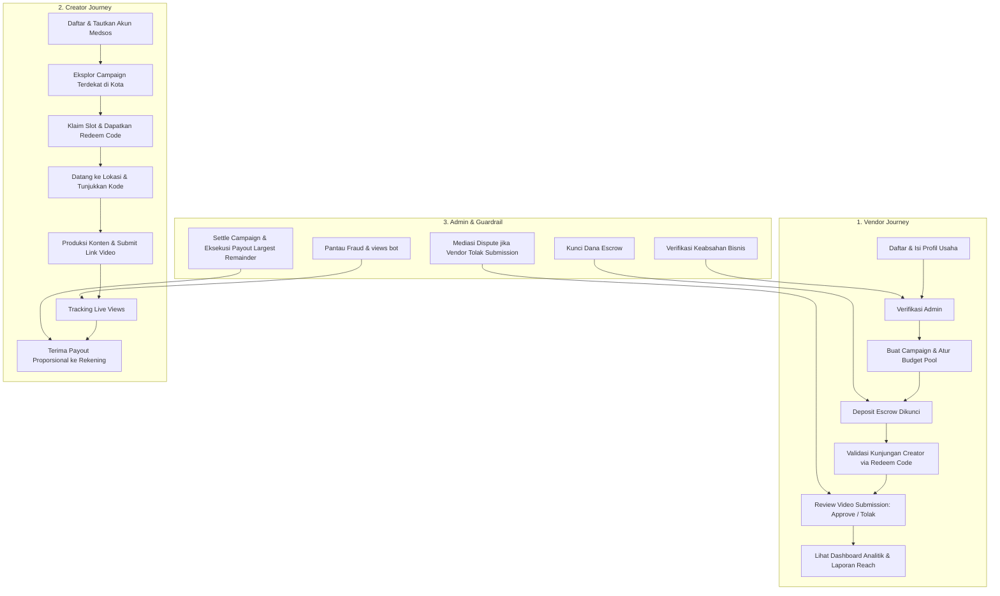

# DESIGN SPECIFICATION: KONTEM PLATFORM

> **Platform Location Campaign Berbasis CPM & Escrow untuk UMKM & Kreator Konten**  
> _Design System, UX Architecture, & Visual Specifications untuk AI/Claude Implementation_

---

## 1. Executive Summary & Visi Produk

**Kontem** adalah platform _third-party location campaign_ yang menjembatani bisnis fisik (kuliner, kafe, destinasi wisata, hiburan) dengan kreator konten lokal (termasuk nano-creator tanpa batas minimum followers).

Mengadopsi mekanika performa _views-based_ (CPM / Cost Per Mille) seperti Motion Klip yang disesuaikan untuk promosi lokasi fisik:

1. **Pay for Real Impact (Bukan Vanity Metrics)**: Vendor tidak membayar harga mahal di muka untuk sekadar postingan endorsement yang belum tentu ditonton; budget dibagi proporsional berdasarkan _real views_ yang didapat.
2. **Nano-Creator Empowerment**: Kreator dengan followers berapapun dapat ikut serta dan berpenghasilan selama konten mereka kreatif dan viral.
3. **Dual-Sided Trust (Anti-Ghosting & Anti-Scam)**:
   - Sistem **Escrow**: Dana vendor dikunci di muka sebelum campaign tayang (kreator terjamin dibayar).
   - Sistem **Bukti Kunjungan (Redeem Code)**: Kreator wajib datang langsung ke outlet fisik untuk klaim komplimen & validasi kunjungan sebelum submit konten.
   - Sistem **Dispute & Audit Trail**: Penolakan submission wajib beralasan dan ditengahi oleh Admin.

---

## 2. Brand Identity & Visual Design Language

> platform patungan langganan premium. Referensinya **satu halaman utuh**, bukan
> sekadar heronya: urutan seksi, bentuk kartu katalog, dan cara angka
> ditampilkan semuanya diambil dari sana. Nilai-nilai di bawah ini dibaca
> langsung dari markup dan stylesheet situs tersebut, bukan dikira-kira:
>
> - **Panel hero biru langit penuh** (`#95D0FD`) selebar layar, nav melayang
>   tanpa latar di atasnya. Judul putih DM Sans Bold `1,75rem → 3,25rem`,
>   ilustrasi figur diletakkan langsung di atas biru — **tanpa panel putih**.
> - **Pita awan putih** (`clouds.webp`, `w-full translate-y-1`) menutup hero.
> - **Kartu kubah** (`rounded-t-[80%] rounded-b-xl`) untuk angka statistik dan
>   label langkah. Kubah statistik **berganti-ganti empat warna**, bukan biru
>   semua; kubah langkah selalu biru `#0284C7`.
> - **Seksi katalog** — inti referensi. Latar biru 10% opasitas, toolbar cari +
>   pilih kategori, lalu grid kartu putih `2 / 3 / 4 kolom`. Tiap kartu:
>   pita diskon menyudut di pojok kiri atas, logo di tengah, judul, **daftar
>   baris tarif** dengan chip pil di kanan tiap baris, bilah stok berisi
>   tulisan di dalamnya, tautan "Lihat Skema Harga" yang membuka modal, dan
>   tombol blok `rounded-lg` selebar kartu.
> - **Panel hitung mundur** di atas grid: kartu putih `rounded-2xl` berisi
>   spanduk biru bergradien, penghitung `00 : 00 : 00`, tiga kartu mini.
> - **Bayangan kartu katalog berpendar biru** (`shadow-2xl shadow-blue-400`) —
>   bukan bayangan netral seperti kartu dasbor.
> - **Baris manfaat**, bukan kartu fitur: satu ilustrasi besar di tengah dengan
>   tiga baris ikon + satu kalimat di kiri dan tiga di kanan.
> - **FAQ akordeon** di atas pita gradien `sky-200 → putih`.
> - **Footer arang gelap `#2D2D2D`** empat kolom — bukan footer biru.
> - **Judul DM Sans Bold**, teks isi Inter — dua keluarga huruf.

### 2.1 Color Palette & Design Tokens

```css
/* Design Tokens Kontem (Tailwind v4 / CSS Variables) */
:root {
  --brand-50: #f0f9ff;
  --brand-100: #e0f2fe;
  --brand-200: #bae6fd; /* garis tepi bernuansa brand */
  --brand-300: #95d0fd; /* LANGIT HERO — panel besar berlatar penuh */
  --brand-400: #38bdf8;
  --brand-500: #0ea5e9; /* PRIMARY — tombol, bilah stok, kubah langkah */
  --brand-600: #0284c7; /* hover, angka harga, kubah langkah, spanduk */
  --brand-700: #0369a1;

  /* ---------- Secondary Accent — Kuning telur ----------
     Pita sorotan pada kartu katalog, satu kubah statistik, badge komplimen.
     TIDAK untuk tombol aksi utama. */
  --accent-50: #fffaeb;
  --accent-100: #fdeec0;
  --accent-400: #ffd45e;
  --accent-500: #fabf18;
  --accent-600: #d9a20b;

  /* ---------- Warna kubah statistik ----------
     Referensi memutar empat warna pada deret kubah angka. Dipakai HANYA di
     sana. Coral dan teal di bawah bukan warna status: jangan dipakai untuk
     badge, callout, atau apa pun yang berarti "gagal" / "berhasil". */
  --stat-sky: #0ea5e9; /* = --brand-500 */
  --stat-coral: #ff5968;
  --stat-teal: #34bb9e;
  --stat-marigold: #fabf18; /* = --accent-500 */

  /* ---------- Ink ---------- */
  --foreground: #0f172a; /* judul & angka penting */
  --body: #475569; /* teks isi */
  --muted: #64748b; /* label, keterangan, placeholder */

  /* ---------- Surfaces ---------- */
  --background: #f8fafc; /* dasar dasbor */
  --surface: #ffffff; /* kartu & dasar halaman depan */
  --surface-muted: #f1f5f9; /* pita pemisah seksi, baris tabel */
  --surface-sky: #e7f5fe; /* latar seksi katalog — brand 10% di atas putih */
  --border: #e2e8f0;

  /* ---------- Footer ----------
     Referensi memakai arang gelap, bukan biru. Navy #0f172a terlalu dekat
     dengan warna judul sehingga footer terbaca seperti kartu raksasa. */
  --footer: #2d2d2d;
  --footer-line: #4a4a4a;
}
```

**Proporsi pemakaian warna** — inilah yang membuat tampilan terasa seperti
referensi, bukan sekadar hex yang sama:

| Warna                                       | Porsi layar | Dipakai untuk                                            |
| :------------------------------------------ | :---------- | :------------------------------------------------------- |
| Putih & abu sangat terang                   | ±55%        | Dasar isi halaman dan kartu katalog                      |
| Biru langit `--brand-300` / `--surface-sky` | ±18%        | Panel hero penuh lebar, latar seksi katalog              |
| Biru `--brand-500`/`600`                    | ±14%        | Tombol, bilah stok, kubah langkah, spanduk hitung mundur |
| Navy `--foreground`                         | ±8%         | Judul dan angka penting                                  |
| Arang `--footer`                            | ±3%         | Footer                                                   |
| Kuning `--accent-500`                       | ±2%         | Pita sorotan kartu katalog, satu kubah angka             |

Warna kubah statistik (coral, teal) tidak masuk hitungan di atas karena hanya
muncul pada satu deret di halaman depan. Kuning yang melebihi porsinya membuat
halaman terasa seperti promo diskon; biru yang melebihi porsinya membuatnya
terasa seperti dasbor korporat.

### 2.2 Typography Hierarchy

Dua keluarga huruf, keduanya dimuat dari Google Fonts — sama persis dengan
referensi (`Inter:wght@100..900` dan `DM+Sans`):

- **Judul — `DM Sans`** (700 untuk judul seksi, 600 untuk judul kartu).
- **Teks & antarmuka — `Inter`** (400/500/600).

```css
--font-display: "DM Sans", "Inter", ui-sans-serif, system-ui, sans-serif;
--font-sans: "Inter", ui-sans-serif, system-ui, sans-serif;
```

| Level                         | Desktop           | Mobile  | Keluarga & Bobot                   |
| :---------------------------- | :---------------- | :------ | :--------------------------------- |
| **Hero Display**              | 3,25rem           | 1,75rem | Display / Bold 700                 |
| **Hero Subtitle**             | 20px              | 15px    | Sans / Regular 400                 |
| **H1 (Page Title)**           | 30–34px           | 25px    | Display / Bold 700                 |
| **H2 (Judul seksi)**          | 2,15rem           | 1,2rem  | Display / Bold 700                 |
| **Sub-judul seksi**           | 16px              | 14px    | Sans / Regular 400, rata tengah    |
| **H3 (Judul kartu katalog)**  | 20px              | 16px    | Display / SemiBold 600             |
| **Baris tarif kartu**         | 14px              | 11px    | Sans / Regular 400, angka SemiBold |
| **Chip pada baris tarif**     | 11px              | 9px     | Sans / SemiBold 600                |
| **Body Large**                | 16–17px           | 15px    | Sans / Regular 400                 |
| **Body Regular**              | 14–15px           | 14px    | Sans / Regular 400                 |
| **Label & Badge**             | 11–12px           | 11px    | Sans / Medium 500                  |
| **Label di dalam bilah stok** | 10px              | 8px     | Sans / Bold 700, putih             |
| **Angka tabular**             | mengikuti konteks | —       | Display / Bold + `tabular-nums`    |

Aturan penting yang terbaca dari referensi:

1. **Judul seksi rata tengah** pada halaman depan, diikuti satu kalimat penjelas
   rata tengah di bawahnya. Di dalam dasbor, judul tetap rata kiri.
2. **Tracking dibiarkan normal.** DM Sans sudah rapat secara bawaan.
3. **Judul di atas panel biru putih.** Untuk teks isi di atas panel biru,
   referensi juga memakai putih — Kontem sengaja memakai navy karena putih 15px
   di atas `#95d0fd` hanya mencapai kontras ~1,9:1. Ini satu-satunya penyimpangan
   tipografi yang disengaja; alasannya dicatat di bagian 10.1.
4. **Label kecil tidak memakai huruf kapital semua**, kecuali tulisan di dalam
   bilah stok yang memang ditulis kapital pada referensi (`189 TERSISA`).
5. **Judul kartu katalog dipotong satu baris** (`truncate`), tidak dibiarkan
   membungkus — supaya tinggi kartu dalam satu baris grid tetap sama.

### 2.3 UI Geometry, Elevation & Micro-Interactions

**Radius** — referensi memakai tiga radius yang berbeda peran; menyeragamkannya
jadi pil semua justru menghapus perbedaan antara "ajakan besar" dan "aksi di
dalam kartu":

| Elemen                                          | Radius                   |
| :---------------------------------------------- | :----------------------- |
| Tombol ajakan hero, badge, chip, pill, tab      | `rounded-full`           |
| **Tombol di dalam kartu katalog & tombol form** | **8px (`rounded-lg`)**   |
| Kotak cari, select, input, textarea             | 12px (`rounded-xl`)      |
| **Kartu katalog & item FAQ**                    | **8px (`rounded-lg`)**   |
| Kartu dasbor standar & kartu fitur              | 16px (`rounded-2xl`)     |
| Panel besar, panel hitung mundur, banner, modal | 24px (`rounded-3xl`)     |
| Kartu angka & label langkah                     | kubah — utilitas `.dome` |

Kubah adalah bentuk khas halaman depan. Resep persisnya, dibaca dari referensi:

```css
/* .dome — sisi atas membusur lebar, sisi bawah membulat biasa.
   Setara `rounded-t-[80%] rounded-b-xl px-4 pb-6 pt-14` pada referensi. */
.dome {
  border-top-left-radius: 80%;
  border-top-right-radius: 80%;
  border-bottom-right-radius: 0.75rem;
  border-bottom-left-radius: 0.75rem;
  padding: 3.5rem 1rem 1.5rem; /* ruang atas disediakan untuk ilustrasi */
}
```

Ilustrasi menumpang di atas kubah dengan `-mb-10 z-10` dan **tinggi yang
dipatok** (`h-28`, atau `h-36` untuk langkah pertama dan terakhir), bukan
dibungkus lingkaran. Rasio aspek unDraw yang berbeda-beda diatasi oleh tinggi
tetap + rata tengah, persis seperti referensi.

**Elevasi** — empat peran, tidak lebih:

```css
--shadow-card:
  0 1px 3px 0 rgba(15, 23, 42, 0.05), 0 1px 2px -1px rgba(15, 23, 42, 0.05);
--shadow-float:
  0 16px 38px -14px rgba(15, 23, 42, 0.16),
  0 4px 12px -6px rgba(15, 23, 42, 0.06);
--shadow-lift: 0 14px 28px -10px rgba(15, 23, 42, 0.16);
--shadow-brand: 0 8px 18px -6px rgba(14, 165, 233, 0.4);

/* Khusus kartu katalog. Referensi memakai `shadow-2xl shadow-blue-400`, yaitu
   bayangan berpendar biru pekat. Di sini alpha-nya diturunkan ke .35 supaya
   grid empat kolom tidak berubah jadi kolam biru. */
--shadow-catalog: 0 25px 50px -12px rgba(96, 165, 250, 0.35);
```

- **Kartu dasbor** memakai `--shadow-card` plus garis tepi `--border`.
- **Kartu mengambang** (metrik, kartu sorotan) memakai `--shadow-float`.
- **Kartu katalog** memakai `--shadow-catalog`, **tanpa garis tepi**.
- **Tombol primary** memakai `--shadow-brand`.

**Micro-interaction**

- Kartu katalog: bayangan menguat saat hover (`--shadow-float` → pekat),
  tanpa `translateY` — kartu dalam grid rapat yang ikut bergerak terasa gelisah.
- Kartu dasbor yang bisa diklik: `translateY(-2px)` + `--shadow-lift`, 180ms.
- Tombol: `scale(1.02)` saat hover, `scale(0.98)` saat ditekan.
- Akordeon FAQ: judul berubah jadi `--brand-500` saat terbuka, ikon berputar
  90°, transisi 200ms.
- Fokus keyboard: cincin 4px `--brand-100` dengan garis tepi `--brand-400`.

**Ilustrasi & elemen dekoratif**

Ilustrasi bergambar orang **diambil dari [unDraw](https://undraw.co)**, bukan
digambar sendiri — lisensinya mengizinkan pemakaian komersial tanpa atribusi,
selama asetnya tidak didistribusikan ulang sebagai paket. Berkasnya ada di
`public/illustrations/`.

- **Setiap ilustrasi baru wajib diwarnai ulang** ke palet Kontem sebelum
  dipakai (ungu `#6c63ff` bawaan unDraw → `#0ea5e9`, kuning → `#fabf18`, dan
  seterusnya). Tabel pemetaan warnanya ada di `public/illustrations/README.md`.
  Satu halaman tidak boleh memuat dua palet sekaligus.
- **Ilustrasi hero diletakkan langsung di atas panel biru**, tanpa kartu putih
  di belakangnya — seperti referensi.
- Bentuk abstrak yang warnanya harus ikut token tetap ditulis sebagai SVG
  inline di `src/app/illustrations.tsx`: `WaveBand` (pita gelombang) dan
  `DomeShape` (badan kubah statistik). Pita awan penutup hero memakai berkas
  gambar `public/illustrations/clouds.webp`, dipasang selebar layar di ujung
  bawah panel biru dengan `translate-y-px` untuk menutup celah subpiksel.
- **Boleh**: konfeti bulat/persegi kecil, gelembung putih berisi satu ikon,
  pita awan dan gelombang, pita sorotan menyudut di pojok kartu katalog.
- **Jangan**: lingkaran ber-_blur_ besar (blob gradien), bayangan drop pada
  ilustrasi, atau menyalin aset milik situs lain yang berhak cipta. Palet dan
  tata letak boleh meniru referensi; asetnya tidak.

**Gradien — dua tempat saja**

Referensi memakai gradien dengan hemat dan selalu pada bidang yang memang
"berbunyi". Di Kontem gradien **hanya** boleh muncul pada:

1. **Spanduk hitung mundur** di panel campaign menjelang tenggat
   (`--brand-600 → --brand-500 → --brand-300`, kiri ke kanan).
2. **Pita sorotan** di pojok kartu katalog (`--accent-500 → --accent-400`).

Di luar dua itu, latar tetap datar. Gradien sebagai latar kartu biasa, banner
dasbor, atau tombol tetap dilarang.

**Ikon**

Ikon antarmuka adalah SVG bergaya garis (_stroke_) 2px bersudut membulat,
diletakkan di dalam kotak `rounded-2xl` berlatar lembut sewarna maknanya.
**Emoji tidak dipakai sebagai ikon antarmuka** — lihat bagian 10.

## 3. Arsitektur Peran & Alur Pengguna (User Journeys)



### 3.1 Role 1: CREATOR (Nano & Local Content Creator)

#### Syarat & Profil Pendaftaran

- Akun terverifikasi (Email / Google Auth / Nomor WhatsApp).
- Tautkan minimal satu akun medsos aktif (TikTok / Instagram Reels / YouTube Shorts) untuk pembuktian kepemilikan.
- **Tanpa Batas Minimum Followers** (terbuka untuk kreator pemula dengan 200 hingga jutaan followers).
- Lokasi domisili (Kota/Kabupaten) untuk penyesuaian kampanye terdekat.
- Akun rekening bank / e-wallet untuk pencairan dana reward.

#### Fitur & UI Kebutuhan Creator

1. **Campaign Explorer**:
   - Filter lokasi/kota (radius terdekat), kategori (Kuliner, Cafe, Wisata Alam, Wahana/Rekreasi), besaran reward pool, rate CPM, dan slot tersisa.
   - Kartu campaign memuat foto tempat, menu/wahana unggulan, compliment (misal: "Gratis 2 Porsi Ramen + Minum"), dan deadline.
2. **Campaign Detail & Claim**:
   - Ringkasan brief: _Angle_ wajib (suasana senja, menu favorit, higienitas), durasi video minimal (misal 30-60 detik), hal yang dilarang (membandingkan kompetitor).
   - Tombol klaim slot yang menghasilkan **Redeem Code / QR Unik**.
3. **Visit Validation (Bukti Kunjungan)**:
   - Layar kartu kode redeem digital untuk ditunjukkan kepada kasir/PIC vendor di outlet.
   - Status berganti dari `"Menunggu Kunjungan"` ➔ `"Kunjungan Terkonfirmasi"` setelah PIC vendor menekan konfirmasi di sistem.
4. **Submission Center**:
   - Form input URL konten publik (TikTok / Instagram Reel / YouTube Shorts).
   - Indikator status: `Menunggu Review`, `Disetujui`, `Perlu Revisi / Ditolak` (dengan tombol _Ajukan Banding ke Admin_).
5. **Earnings & Live Views Tracker**:
   - Kartu saldo mengambang: Estimasi perolehan rupiah berjalan sesuai porsi views terkumpul dibanding total views campaign.
   - Riwayat payout dan notifikasi otomatis (SMS/WA/Email/In-app).

---

### 3.2 Role 2: VENDOR (Resto, Kafe, Tempat Wisata)

#### Syarat & Profil Pendaftaran

- Nama usaha, alamat lengkap + pinpoint Google Maps, foto tempat, kategori bisnis, dan kontak WhatsApp PIC.
- Verifikasi awal oleh tim Admin (pengecekan Google Maps, review foto, dan telepon konfirmasi singkat).

#### Fitur & UI Kebutuhan Vendor

1. **Campaign Creation Wizard (Langkah demi Langkah)**:
   - **Step 1: Info Dasar & Kategori**: Template khusus Resto/F&B vs Tempat Wisata.
   - **Step 2: Komplimen / Fasilitas**: Voucher makan senilai Rp 150rb, gratis tiket masuk untuk 2 orang, dsb.
   - **Step 3: Budgeting & CPM**:
     - Input total pool dana promosi (misal: Rp 2.500.000).
     - Input rate CPM yang ditawarkan (misal: Rp 25.000 per 1.000 views).
     - Sistem otomatis menampilkan estimasi total target views (misal: 100.000 total views).
     - Batas kuota kreator (misal: maksimal 15 kreator).
   - **Step 4: Content Brief & Rules**: Panduan do's & don'ts, teks promosi yang wajib dicantumkan dalam caption/video.
   - **Step 5: Deposit Escrow**: Pembayaran di muka ke rekening penampung Kontem.
2. **In-Store Redeem Validator**:
   - Antarmuka super simpel bagi kasir/manajer resto di handphone: cukup masukkan 6 digit kode unik kreator atau scan QR untuk mengesahkan bahwa kreator benar-benar datang dan menikmati fasilitas.
3. **Submission Review Desk**:
   - Tampilan daftar video yang diunggah kreator dengan pratinjau instan.
   - Tombol **Setujui** atau **Tolak**.
   - _Guardrail Anti-Abuse_: Jika menolak, vendor **wajib** memilih kategori pelanggaran brief (misal: "Nama resto tidak disebutkan", "Video menggunakan materi orang lain", "Kualitas gambar pecah/buram") dan melampirkan catatan detail.
4. **Live Performance Dashboard**:
   - Real-time views gauge, sisa hari campaign, persentase budget terserap, dan papan peringkat kreator terbaik (_Top Performing Creators_).
   - Tombol _"Undang Lagi"_ untuk mengontrak kembali kreator yang performanya memuaskan.

---

### 3.3 Role 3: ADMIN & TRUST ARBITRATOR

#### Peran Utama

Sebagai penjaga keadilan dan integritas ekosistem dua sisi (_Two-Sided Trust Protocol_).

#### Fitur & UI Kebutuhan Admin

1. **Vendor Verification Queue**:
   - Antarmuka pengecekan data vendor baru (tinjau foto, tautan Google Maps, status PIC).
2. **Escrow & Settlement Desk**:
   - Verifikasi deposit dana masuk dari vendor.
   - _One-Click Settlement_: Mengunci angka views akhir saat periode kampanye berakhir, menghitung pembagian dana pool secara proporsional dengan metode _Largest Remainder_, memotong komisi platform (default 15%), dan mengeksekusi pencairan transfer ke kreator serta pengembalian sisa pool yang belum terserap ke vendor.
3. **Dispute & Mediation Center**:
   - Panel khusus jika ada kreator yang mengajukan banding terhadap penolakan submission oleh vendor.
   - Admin melihat video, mencocokkan dengan brief, melihat alasan vendor, dan menetapkan keputusan final yang mengikat.
4. **Anti-Fraud & Views Integrity Monitor**:
   - Sistem deteksi anomali: flag otomatis jika angka views turun (views medsos asli tidak pernah berkurang), lonjakan views bot yang mendadak, atau akun kreator ganda.
5. **Business Analytics & Export**:
   - Metrik GMV, _take-rate fee_, jumlah kreator aktif, total views tergenerasi untuk materi investor dan _pitching_.

---

## 4. Model Finansial, Escrow & Algoritma Payout

### 4.1 Mekanika Pembagian Pool Berbasis Views

Dua prinsip utama:

1. **Tarif Berbasis CPM**: Kreator mendapatkan `(Views / 1000) × CPM Rate`.
2. **Budget Pool Sebagai Plafon Keras (Hard Cap)**: Total biaya yang dibayar vendor tidak akan pernah melampaui dana pool yang sudah disetor di muka.

```
Kondisi A: Total Tagihan CPM < Budget Pool
- Setiap kreator dibayar penuh sesuai formula CPM.
- Sisa dana pool yang tidak terserap dikembalikan utuh (refund) ke vendor.
- Platform fee (15%) dipotong hanya dari pembayaran riil yang diterima kreator.

Kondisi B: Total Tagihan CPM >= Budget Pool (Over-Cap)
- Seluruh budget pool dibagi proporsional berdasarkan persentase kontribusi views:
  Bagian Kreator = (Views Kreator / Total Views Seluruh Kreator) × Budget Pool
- Menggunakan algoritma pembulatan "Largest Remainder" agar total payout genap 100% sampai ke satuan rupiah terkecil.
```

### 4.2 Simulasi Payout

| Kreator             | Valid Views | Porsi Views | Payout Kotor (Pool Rp 2.500.000) | Fee Kontem (15%) | Payout Bersih Kreator |
| :------------------ | :---------- | :---------- | :------------------------------- | :--------------- | :-------------------- |
| **@kuliner.malang** | 65.000      | 52,0%       | Rp 1.300.000                     | Rp 195.000       | **Rp 1.105.000**      |
| **@foodiejatim**    | 35.000      | 28,0%       | Rp 700.000                       | Rp 105.000       | **Rp 595.000**        |
| **@nongkrong.yuk**  | 25.000      | 20,0%       | Rp 500.000                       | Rp 75.000        | **Rp 425.000**        |
| **TOTAL**           | **125.000** | **100%**    | **Rp 2.500.000**                 | **Rp 375.000**   | **Rp 2.125.000**      |

---

## 5. Blueprint Halaman & Spesifikasi Tata Letak (Layout Specs)

> Seluruh halaman mengadaptasi struktur: panel hero biru penuh lebar yang ditutup pita awan, deret kartu kubah berisi angka nyata, seksi katalog berlatar biru pucat dengan grid kartu putih berbayang biru, lima langkah berbentuk kubah, akordeon FAQ, dan footer arang. Tombol ajakan berbentuk pil; tombol di dalam kartu berbentuk blok `rounded-lg`.

### 5.1 LANDING PAGE

Urutan seksinya mengikuti /#products dari atas ke bawah, dengan isi
diterjemahkan ke domain Kontem. **Urutan ini mengikat** — katalog campaign
muncul lebih dulu daripada "Cara kerjanya", karena pengunjung yang datang dari
tautan `#campaign` harus langsung melihat barangnya.

```
+-----------------------------------------------------------------------------------------------+
|  NAV melayang (fixed, h-14 / h-16, tanpa latar) — tautan putih, tombol Masuk rounded-lg       |
|  bergaris putih, berlatar biru penuh saat halaman di-scroll                                   |
+-----------------------------------------------------------------------------------------------+
|  1. HERO — PANEL BIRU LANGIT (--brand-300), pt-28                                             |
|                                                                                               |
|  Promosikan tempatmu lewat            [ ilustrasi unDraw figur, LANGSUNG di atas biru,        |
|  kreator lokal, bayar                   tanpa panel putih, w-9/12 di ponsel ]                 |
|  sesuai views       (putih, DM Sans Bold, 1,75rem -> 3,25rem)                                 |
|  Budget dikunci di escrow...  (navy, 15px -> 20px)                                            |
|  [ Lihat campaign ]  <- pill besar: px-14 py-3.5/py-5, 15px -> 20px, brand-500                |
|                                                                                               |
|  ~~~~~~~~~~~~~~~  PITA AWAN (clouds.webp, w-full translate-y-px)  ~~~~~~~~~~~~~~~~~~~~~~~~~~  |
+-----------------------------------------------------------------------------------------------+
|  2. ANGKA NYATA — "Gabung di Kontem sekarang!" (rata tengah + satu kalimat)                    |
|                                                                                               |
|    [ilustrasi]   [ilustrasi]   [ilustrasi]   [ilustrasi]   <- menumpang, h-28, -mb-10         |
|   +---------+   +---------+   +---------+   +---------+                                       |
|   |  KUBAH  |   |  KUBAH  |   |  KUBAH  |   |  KUBAH  |   <- .dome, EMPAT WARNA berbeda:      |
|   |    5    |   |    2    |   |    2    |   | 467,9k  |      sky / coral / teal / marigold    |
|   | Creator |   |Campaign |   | Vendor  |   | Views   |      angka & label putih, DARI DB     |
|   +---------+   +---------+   +---------+   +---------+                                       |
+-----------------------------------------------------------------------------------------------+
|  3. MANFAAT — "Kenapa lewat Kontem?"  (BUKAN grid kartu)                                      |
|   tiga baris ikon + satu kalimat  |  ILUSTRASI BESAR  |  tiga baris ikon + satu kalimat       |
|   (rata kanan, ikon di kanan)     |   di tengah       |   (rata kiri, ikon di kiri)           |
+-----------------------------------------------------------------------------------------------+
|  4. KATALOG CAMPAIGN — latar --surface-sky, id="campaign"      <-- INTI REFERENSI              |
|                                                                                               |
|   "Campaign yang sedang berjalan"  (judul rata tengah)                                        |
|   [ Cari campaign............ ]   [ Semua kategori v ]   <- toolbar 4/12 + 4/12 kolom         |
|                                                                                               |
|   +-------------------------------------------------------------------------------+          |
|   |  PANEL TENGGAT (putih, rounded-3xl, shadow)                                    |          |
|   |   +-----------------------------------------------------------------+          |          |
|   |   |  spanduk biru bergradien        Berakhir dalam: [00]:[00]:[00]  |          |          |
|   |   +-----------------------------------------------------------------+          |          |
|   |   [mini card]      [mini card]      [mini card]        <- 3 kolom              |          |
|   |                      Lihat semua ->                                            |          |
|   +-------------------------------------------------------------------------------+          |
|                                                                                               |
|   GRID KARTU KATALOG — grid-cols-2 lg:grid-cols-3 xl:grid-cols-4, gap-3 lg:gap-7              |
|   (spesifikasi kartunya di bagian 6.5)                                                        |
+-----------------------------------------------------------------------------------------------+
|  5. CARA KERJANYA — lima langkah, id="cara-kerja"                                             |
|   Tiap langkah: ilustrasi unDraw h-28 menumpang di atas KUBAH biru --brand-600 berisi          |
|   lingkaran putih bernomor + judul langkah sebaris. Penjelasan di bawah kubah.                 |
+-----------------------------------------------------------------------------------------------+
|  6. CARA DANA DIJAGA — deretan lambang metode pembayaran + ilustrasi figur di atas             |
|   bidang gelombang (WaveBand), satu paragraf penjelas escrow rata tengah                      |
+-----------------------------------------------------------------------------------------------+
|  7. APA KATA MEREKA — hanya ditampilkan kalau ada testimoni nyata di database.                |
|   Kalau belum ada, seksi ini TIDAK dirender (jangan diisi kutipan karangan).                  |
+-----------------------------------------------------------------------------------------------+
|  8. MULAI HARI INI — dua kartu ajakan (creator / pemilik usaha), 4 poin + tombol               |
+-----------------------------------------------------------------------------------------------+
|  9. FAQ — akordeon di atas pita gradien sky-200 -> putih, id="faq"                             |
|   Tiap item: kartu putih rounded-lg shadow, judul SemiBold, ikon chevron berputar 90 derajat   |
+-----------------------------------------------------------------------------------------------+
|  10. Kartu akun demo                                                                          |
+-----------------------------------------------------------------------------------------------+
|  FOOTER ARANG (--footer #2d2d2d), empat kolom: deskripsi + Kontem + Campaign + Sosial media    |
+-----------------------------------------------------------------------------------------------+
```

Aturan yang mengikat pada halaman ini:

1. **Setiap angka pada kartu kubah, kartu katalog, dan panel tenggat berasal
   dari query database.** Kalau datanya belum ada, seksinya tidak ditampilkan —
   bukan diisi angka contoh.
2. **Nav melayang tanpa latar** di atas hero (`fixed inset-x-0 top-0 z-40`),
   lalu berlatar `--brand-500` setelah halaman di-scroll — supaya panel biru
   terbaca sebagai satu bidang penuh.
3. **Hanya satu tombol primary per layar hero.** Tombol pada kartu katalog tidak
   dihitung sebagai primary layar, karena letaknya di dalam kartu.
4. **Empat kubah statistik memutar empat warna** sesuai urutan token
   `--stat-sky → --stat-coral → --stat-teal → --stat-marigold`. Urutannya tetap,
   tidak diacak per-render.
5. **Panel tenggat hanya muncul kalau ada campaign yang berakhir < 72 jam.**
   Hitung mundur palsu adalah bentuk tekanan jual yang tidak boleh dipakai di
   platform yang menjanjikan transparansi.

### 5.2 CREATOR DASHBOARD (`/creator/*`)

#### 1. Halaman Browse Campaign (`/creator/campaigns`)

- **Toolbar** mengikuti seksi katalog referensi: satu kotak cari berikon kaca
  pembesar (lebar 4/12) dan satu `select` kategori (lebar 4/12) sebaris, di
  bawah judul halaman. Penyaringan terjadi langsung saat mengetik atau memilih —
  tanpa tombol "Cari" terpisah.
- **Filter tambahan** sebagai baris chip pil di bawah toolbar: Kota (Malang,
  Surabaya, Jakarta, Bandung, Bali) dan Urutkan (Budget Tertinggi, Slot
  Terbatas, Terbaru).
- **Grid kartu**: `grid-cols-2 lg:grid-cols-3 xl:grid-cols-4`, gap `3` di ponsel
  dan `7` di desktop — sama dengan referensi.
- **Komponen kartunya adalah Kartu Katalog** yang dispesifikasikan penuh di
  bagian 6.5. Halaman ini tidak mengarang bentuk kartu sendiri.

#### 2. Halaman Detail Campaign & Klaim (`/creator/campaigns/[id]`)

- Banner lokasi + maps tersemat.
- Rincian Brief Kreatif:
  - _Must-Include Elements_: Menampilkan logo resto, suasana outdoor, review rasa makanan secara jujur, mention akun IG/TikTok @kopisenja.
  - _Do's & Don'ts_: Dilarang menjelekkan tempat lain, resolusi video minimal 1080p, durasi 30-90 detik.
- Kuota & Countdown Periode Campaign — memakai bentuk penghitung yang sama
  dengan panel tenggat halaman depan (`00 : 00 : 00` dalam kotak `rounded-lg`
  berlatar `--brand-600`).
- Tombol: `Klaim Slot Sekarang` (Membuka popup persetujuan komitmen kunjungan).

#### 3. Halaman Tiket Kunjungan & Redeem (`/creator/active/[id]`)

- **Kartu Redeem Interaktif**:
  - Kode 6 Karakter Besar (contoh: `KT-7892`) + Tombol Salin.
  - QR Code yang dapat di-scan oleh kasir vendor.
  - Panduan: _"Tunjukkan layar ini ke kasir sebelum memesan menu komplimen Anda."_
  - Badge Status: `MENUNGGU VERIFIKASI KUNJUNGAN` (Oranye) ➔ `KUNJUNGAN TERVERIFIKASI` (Hijau).

#### 4. Form Submit Konten (`/creator/active/[id]/submit`)

- Input URL Video Publik (TikTok / Reels / Shorts).
- Checklist Konfirmasi:
  - [x] Konten dibuat sendiri di lokasi fisik.
  - [x] Sesuai dengan brief dan tidak diprivat.
- Preview otomatis thumbnail dan status moderasi vendor.

#### 5. Dashboard Pendapatan & Payout (`/creator/earnings`)

- Saldo Masuk, Saldo Berjalan (Estimasi), dan Riwayat Transfer Sukses.
- Tabel rincian views per campaign dengan formula transparan.

---

### 5.3 VENDOR DASHBOARD (`/vendor/*`)

#### 1. Beranda Vendor (`/vendor/dashboard`)

- Quick Stats: Total Views Dihasilkan, Total Creator yang Datang, Sisa Budget Escrow Aktif.
- Quick Action: Tombol `Input / Scan Kode Redeem Creator` (ditempatkan di tempat strategis untuk kasir).
- Daftar Campaign Aktif dengan status penyerapan budget.

#### 2. Wizard Buat Campaign Baru (`/vendor/campaigns/new`)

- Form interaktif dengan panduan harga rekomendasi (_CPM rate assistant_ berdasarkan rata-rata kategori).
- Input Komplimen (misal: Diskon 100% hingga Rp 100.000).
- Penentuan kuota dan durasi hari kampanye.
- Ringkasan Tagihan Escrow + Instruksi Pembayaran (Virtual Account / QRIS).

#### 3. Panel Validator Redeem Kode Kasir (`/vendor/redeem`)

- Desain _mobile-friendly_: Input besar 6 digit kode.
- Saat kode dimasukkan, muncul info kreator: Foto profil, nama, dan hak komplimen yang didapat.
- Tombol hijau: `Konfirmasi Kehadiran & Berikan Komplimen`.

#### 4. Review Submission Creator (`/vendor/submissions`)

- Kolom kartu video masuk.
- Pemutar video terintegrasi atau tautan langsung ke platform medsos.
- Tombol:
  - `Setujui Konten`
  - `Minta Klarifikasi / Tolak` (Memunculkan formulir wajib: Alasan spesifik penolakan).

---

### 5.4 ADMIN CONTROL ROOM (`/admin/*`)

#### 1. Verifikasi Bisnis & Vendor Baru (`/admin/vendors`)

- Pengecekan bukti foto outlet, titik Google Maps, dan tombol approve/reject akun vendor.

#### 2. Dispute Resolution Hub (`/admin/disputes`)

- Daftar komplain dari kreator yang submission-nya ditolak vendor.
- Pratinjau video, teks brief, dan argumen kedua belah pihak.
- Tindakan admin: `Override Approve (Kreator Benar)` atau `Tetap Tolak (Vendor Benar)`.

#### 3. Views Tracking & Manual/API Input (`/admin/views`)

- Input batch views berkala sebelum sistem terintegrasi scraper/API resmi media sosial.
- Pengecekan kecurangan (anomali views bot).

#### 4. Escrow Settlement & Payout Manager (`/admin/payouts`)

- Tombol `Hitung Pembagian Pool` (menjalankan algoritma kalkulasi).
- Pratinjau daftar transfer sebelum dikirimkan ke payment gateway / bank transfer.

---

## 6. Spesifikasi Komponen UI (Design System Components)

### 6.1 Buttons & Interactive Controls

Referensi memakai **dua bentuk tombol**, dan perbedaannya bermakna: pil besar
untuk ajakan halaman, kotak membulat selebar induknya untuk aksi di dalam kartu
atau form. Menyeragamkan keduanya jadi pil membuat tombol "Klaim Slot" di dalam
kartu katalog terlihat seperti ajakan utama halaman.

```tsx
// --- Bentuk pil: ajakan hero, chip, tab, badge ---
HeroButton:     // satu per layar hero
  "rounded-full bg-[--brand-500] px-14 py-3.5 lg:py-5 text-[15px] lg:text-xl
   font-semibold text-white shadow-[--shadow-brand] transition-all
   hover:bg-[--brand-600] hover:scale-[1.02] active:scale-[0.98]"

PrimaryButton:
  "rounded-full bg-[--brand-500] px-6 py-3 text-sm font-semibold text-white
   shadow-[--shadow-brand] transition-all
   hover:bg-[--brand-600] hover:scale-[1.02] active:scale-[0.98]"

SecondaryButton:
  "rounded-full border border-[--border] bg-white px-6 py-3 text-sm
   font-semibold text-[--body] shadow-[--shadow-card] transition-all
   hover:border-[--brand-200] hover:bg-[--brand-50]"

GhostButton:
  "rounded-full px-4 py-2 text-sm font-medium text-[--muted]
   transition-colors hover:bg-[--brand-50] hover:text-[--brand-700]"

// --- Bentuk blok: tombol di dalam kartu katalog dan tombol form ---
BlockButton:
  "block w-full rounded-lg bg-[--brand-500] py-2.5 text-center text-sm
   lg:text-base font-medium text-white transition-colors
   hover:bg-[--brand-600]"

// Tombol Masuk di nav hero: kotak membulat bergaris putih di atas biru.
NavButton:
  "grid h-9 place-items-center rounded-lg border border-white px-5
   text-sm font-medium text-white transition-colors hover:bg-[--brand-500]"

// --- Kontrol isian: radius 12px, teks panjang harus terbaca ---
Input:
  "w-full rounded-xl border border-[--border] bg-white px-4 py-2.5
   text-sm text-[--body] outline-none transition-colors
   placeholder:text-[--muted]
   focus:border-[--brand-400] focus:ring-4 focus:ring-[--brand-100]"

SearchInput:    // toolbar katalog — ikon di dalam, sebelah kiri
  "w-full rounded-xl border border-[--border] bg-white py-2.5 pl-11 pr-5
   text-sm text-[--body] placeholder:text-[--muted]
   focus:border-[--brand-400] focus:ring-4 focus:ring-[--brand-100]"
```

Aturan hierarki: **satu tombol pil primary per layar**. Tombol blok di dalam
kartu katalog tidak dihitung, karena bentuknya sudah membedakan dirinya sebagai
aksi milik kartu, bukan milik halaman.

**Bentuk dan ukuran dioper lewat prop** (`shape`: `pill` | `block`; `size`:
`sm` / `md` / `lg` / `compact`), tidak pernah lewat `className`. `cn()` hanya
menyambung string, sehingga dua kelas padding atau radius yang bertabrakan
diputuskan oleh urutan stylesheet — bukan oleh yang ditulis belakangan.

### 6.2 Floating Cards & Metric Chips

Kartu putih mengambang dipakai untuk menonjolkan satu angka di dalam dasbor.

```tsx
<div className="rounded-2xl bg-white p-4 shadow-[--shadow-float]">
  <p className="text-xs text-[--muted]">Estimasi penghasilan</p>
  <p
    className="mt-1 font-display text-lg font-bold tabular-nums
                text-[--foreground]"
  >
    Rp 1.105.000
  </p>
  <p className="mt-0.5 text-xs font-semibold text-[--success]">
    +28% pekan ini
  </p>
</div>
```

Ketentuan:

- Isinya maksimal tiga baris: label, angka, satu keterangan pendek.
- Tanpa garis tepi — bayangan mengambang yang memisahkannya dari latar.
- Maksimal tiga kartu mengambang per layar.
- **Angka di dalamnya wajib berasal dari database.**
- Di halaman depan, peran ini dipegang **kartu kubah**, bukan kartu mengambang.

### 6.3 State & Status Indicator Matrix

Badge adalah keterangan, bukan judul: pill kecil berlatar lembut tanpa garis
tepi, teks 11px berbobot Medium, dan **titik penanda 6px** di sebelah kiri —
bukan ikon garis.

| State                          | Token latar       | Token teks     | Token garis      | Warna titik   |
| :----------------------------- | :---------------- | :------------- | :--------------- | :------------ |
| **Escrow dikunci / disetujui** | `--success-bg`    | `--success`    | `--success-line` | Check         |
| **Menunggu kunjungan**         | `--warning-bg`    | `--warning`    | `--warning-line` | MapPin        |
| **Kunjungan terkonfirmasi**    | `--visit-bg`      | `--visit`      | `--visit-line`   | Coffee        |
| **Dalam review vendor**        | `--review-bg`     | `--review`     | `--review-line`  | Clock         |
| **Ditolak / sengketa**         | `--danger-bg`     | `--danger`     | `--danger-line`  | AlertTriangle |
| **Payout dicairkan**           | `--payout-bg`     | `--payout`     | `--payout-line`  | Wallet        |
| **Komplimen / sorotan**        | `--accent-50`     | `--accent-600` | `--accent-100`   | Star          |
| **Netral / draft**             | `--surface-muted` | `--muted`      | `--border`       | —             |

```tsx
BadgePill:
  "inline-flex items-center gap-1.5 rounded-full px-2 py-0.5
   text-[11px] font-medium"
```

**Varian `chip`** — dipakai pada baris fakta kartu katalog. Bentuknya sama,
tapi berlatar brand transparan dan bertulisan SemiBold, persis seperti chip
durasi pada referensi:

```tsx
FactChip:
  "rounded-full bg-[--brand-500]/30 px-1.5 py-0.5 text-[9px] lg:text-[11px]
   font-semibold text-[--brand-600] whitespace-nowrap"
```

Kartu keunggulan di dalam dasbor memakai varian **`soft`**: latar biru pucat
`--brand-50` tanpa garis tepi. Kartu besar (dua kartu ajakan) memakai varian
**`panel`** berradius 24px. Keduanya prop pada `<Card>`, bukan kelas lewat
`className`.

### 6.4 Baris Manfaat & Kartu Fitur

**Di halaman depan, manfaat ditampilkan sebagai baris — bukan grid kartu.**
Referensi meletakkan satu ilustrasi besar di tengah, dengan tiga baris di kiri
(teks rata kanan, ikon di kanan) dan tiga baris di kanan (ikon di kiri, teks
rata kiri). Tiap baris hanya **satu kalimat pendek**, tanpa paragraf penjelas.

```tsx
<li className="grid grid-cols-12 items-center gap-3">
  <p
    className="col-span-9 text-xs lg:text-lg font-normal lg:font-medium
                text-left lg:text-right"
  >
    Dana dikunci di escrow sebelum campaign tayang
  </p>
  <div className="col-span-3 lg:ml-auto">
    <IconShield className="h-9 w-9 text-[--brand-500]" strokeWidth={2} />
  </div>
</li>
```

**Kartu fitur `rounded-2xl` tetap dipakai di dalam dasbor** — di sana penjelasan
dua baris memang dibutuhkan:

```tsx
<div
  className="rounded-2xl border border-[--border] bg-white p-5
                shadow-[--shadow-card]"
>
  <div
    className="flex h-10 w-10 items-center justify-center rounded-xl
                  bg-[--brand-50] text-[--brand-700]"
  >
    <IconShield className="h-5 w-5" strokeWidth={2} />
  </div>
  <h3 className="mt-4 font-display font-semibold text-[--foreground]">
    Dana dikunci di escrow
  </h3>
  <p className="mt-1.5 text-sm leading-relaxed text-[--muted]">
    Vendor menyetor di depan. Creator tidak pernah bekerja tanpa jaminan.
  </p>
</div>
```

Warna kotak ikon mengikuti maknanya, bukan dirotasi asal supaya "berwarna-warni":
biru untuk mekanisme netral, marigold untuk komplimen dan imbalan, hijau untuk
hasil yang sudah beres.

### 6.5 Kartu Katalog Campaign — komponen inti

#products`. Semua halaman
yang menampilkan daftar campaign memakai komponen ini: halaman depan,
`/creator/campaigns`, dan daftar "Undang lagi" milik vendor.

```
+---------------------------------------+
|/CPM Rp 30rb/                          |  <- pita sorotan, pojok kiri atas,
|                                       |     rounded-r-full, gradien marigold
|      [ foto tempat, rasio 16:9 ]      |
|                                       |
|  Kopi Senja Dinoyo                    |  <- DM Sans SemiBold, truncate
|                                       |
|  Budget pool                          |
|  Rp 3.000.000              ( 12 slot )|  <- angka SemiBold + chip di kanan
|  Tarif CPM                            |
|  Rp 30.000 /1k views    ( 14 hari )   |
|  Komplimen                            |
|  Gratis 1 makanan + minuman           |
|                                       |
|  [######## Sisa 3 dari 12 slot ]      |  <- bilah stok, tulisan DI DALAM
|                                       |
|  (o) Lihat skema payout               |  <- tautan abu kecil -> modal
|  [        Klaim Slot        ]         |  <- tombol blok rounded-lg
+---------------------------------------+
```

```tsx
<article
  className="relative flex flex-col justify-between rounded-lg bg-white
                    p-2.5 shadow-[--shadow-catalog] transition-shadow
                    hover:shadow-[--shadow-float]"
>
  {/* Pita sorotan — satu-satunya gradien yang diizinkan di kartu. */}
  <div
    className="absolute left-0 top-0 rounded-r-full rounded-tl-[5px]
                  bg-gradient-to-r from-[--accent-500] to-[--accent-400]
                  px-2.5 py-1 lg:py-1.5"
  >
    <span
      className="block text-[10px] lg:text-xs font-semibold
                     text-[--foreground]"
    >
      CPM Rp 30rb
    </span>
  </div>

  {/* Foto tempat menggantikan slot logo pada referensi. */}
  

  <h3 className="mt-3 truncate font-display text-base lg:text-xl font-semibold">
    Kopi Senja Dinoyo
  </h3>

  {/* Daftar baris fakta — maksimal tiga baris. */}
  <ul className="mt-2 flex flex-col gap-3">
    <li className="flex items-center justify-between gap-2">
      <div>
        <p className="text-[11px] lg:text-[13px] text-[--muted]">Budget pool</p>
        <p className="text-[11px] lg:text-[14px] tabular-nums">
          <span className="font-semibold text-[--brand-600]">Rp 3.000.000</span>
        </p>
      </div>
      <FactChip>12 slot</FactChip>
    </li>
    {/* ...Tarif CPM, Komplimen */}
  </ul>

  {/* Bilah slot: tulisan di dalam bilah, bukan di atasnya. */}
  <div className="mt-4 h-4 overflow-hidden rounded-full bg-[--surface-muted]">
    <div
      className="flex h-4 items-center justify-center rounded-full
                    bg-[--brand-500] text-[10px] font-bold text-white"
      style={{ width: "75%" }}
    >
      Sisa 3 dari 12 slot
    </div>
  </div>

  <button
    className="mt-2.5 text-[10px] lg:text-[13px] text-[--muted]
                     hover:text-[--foreground]"
  >
    <IconEye className="inline h-3.5 w-3.5" /> Lihat skema payout
  </button>

  <BlockButton>Klaim Slot</BlockButton>
</article>
```

Ketentuan yang mengikat:

1. **Isi pita sorotan selalu angka tarif CPM**, bukan kata-kata promosi.
   Warnanya marigold, bukan ungu→merah muda seperti referensi, karena marigold
   sudah menjadi warna "komplimen dan imbalan" di Kontem dan putih di atas
   marigold tidak terbaca — teksnya navy.
2. **Maksimal tiga baris fakta.** Kalau sebuah campaign punya lebih banyak hal
   menarik, itu isi halaman detail, bukan kartu.
3. **Tulisan bilah slot ada di dalam bilah.** Kalau bagian yang terisi kurang
   dari 45%, tulisan dipindah ke tengah _track_ dengan warna `--foreground`,
   supaya tidak terpotong. Ini penyesuaian yang wajib — pada referensi tulisan
   memang terpotong saat stok tinggal sedikit.
4. **Bilah menunjukkan slot terpakai, bukan sisa** — arah isian mengikuti arah
   perjalanan campaign. Tulisannya tetap menyebut sisanya, karena itu yang
   dibutuhkan creator.
5. **Tanpa garis tepi.** Yang memisahkan kartu dari latar biru pucat adalah
   `--shadow-catalog`.
6. **Hover hanya mengubah bayangan**, tidak mengangkat kartu.
7. Kalau slot habis atau campaign ditutup: tombol jadi _disabled_ bertulisan
   `Slot penuh`, bilah menjadi `--muted`, dan pita sorotan dilepas.

### 6.6 Toolbar Katalog & Panel Tenggat

**Toolbar** diletakkan tepat di bawah judul seksi, dua kolom `4/12` yang
merenggang ke tepi (`justify-between`):

```tsx
<div className="mt-3 flex flex-wrap justify-between gap-3 lg:gap-0">
  <div className="w-full lg:w-4/12">
    <IconSearch className="absolute ml-3.5 h-5 w-5 text-[--muted]" />
    <SearchInput placeholder="Cari campaign" />
  </div>
  <div className="w-full lg:w-4/12">
    <select
      className="w-full rounded-xl border border-[--border] bg-white
                       px-5 py-2.5 text-sm"
    >
      <option>Semua kategori</option>
    </select>
  </div>
</div>
```

Penyaringan berjalan saat mengetik (`onKeyUp`) dan saat memilih (`onChange`).
Tidak ada tombol "Cari" — pada referensi pun tidak ada.

**Panel tenggat** adalah adaptasi panel _flash sale_. Isinya campaign yang
berakhir kurang dari 72 jam:

- Bungkus: `rounded-3xl bg-white shadow-[--shadow-float]` di desktop; di ponsel
  bungkusnya justru berlatar `--brand-500` dengan kartu mini putih di dalamnya.
- Spanduk atas: bidang `h-[100px] rounded-md` bergradien
  `--brand-600 → --brand-500 → --brand-300` dengan konfeti vektor datar.
- Penghitung di kanan spanduk: label "Berakhir dalam:" 12px SemiBold putih, lalu
  tiga kotak `rounded-lg bg-[--brand-600] px-2 py-2` berisi angka 20px Bold
  putih dipisah titik dua.
- Isi: `grid grid-cols-3 gap-4` kartu mini `rounded-md bg-white p-4
min-h-[164px]` — logo bulat 32px + judul, lalu satu baris fakta, lalu bilah
  slot. Kartu mini **tidak** punya tombol; seluruh kartunya sendiri sebuah
  tautan.
- Penutup: tautan `Lihat semua →` rata tengah.

Panel ini tidak dirender kalau tidak ada campaign yang memenuhi syarat.

### 6.7 Akordeon FAQ & Footer

**Akordeon FAQ** duduk di atas pita gradien vertikal `--brand-200 → putih`
(`bg-gradient-to-t`), satu-satunya pita gradien di halaman — dan gradien ini
dikecualikan dari larangan bagian 2.3 karena ia pemisah seksi, bukan latar
kartu.

```tsx
<div className="rounded-lg bg-white p-2 lg:p-3 shadow-[--shadow-card]">
  <button
    className="flex w-full items-center justify-between text-left
                     text-xs lg:text-base font-semibold"
  >
    <span className={expanded ? "text-[--brand-500]" : ""}>
      Berapa lama dana escrow dikunci?
    </span>
    <IconChevronRight
      className={cn("h-5 w-5 flex-none duration-200", expanded && "rotate-90")}
    />
  </button>
</div>
```

Jarak antar item `space-y-3`. Ikonnya chevron kanan yang berputar 90°, bukan
tanda plus-minus.

**Footer** berlatar `--footer` (#2d2d2d), `py-10`, empat kolom:

| Kolom | Lebar | Isi                                                                         |
| :---- | :---- | :-------------------------------------------------------------------------- |
| 1     | 6/12  | Nama Kontem (DM Sans SemiBold 18px putih) + satu paragraf deskripsi 13–15px |
| 2     | 2/12  | Kontem — Tentang, Cara kerja, Kontak                                        |
| 3     | 2/12  | Campaign — Untuk creator, Untuk vendor                                      |
| 4     | 2/12  | Sosial media                                                                |

Seluruh teks footer putih; tautan tanpa garis bawah, `hover:underline`. Footer
**tidak** memakai biru — biru sudah dipakai hero dan seksi katalog, dan footer
biru membuat halaman terasa dibungkus warna yang sama dari atas sampai bawah.

## 7. Skema Data & Relasi Entitas (Prisma References)

```prisma
// Ringkasan Arsitektur Relasi Data Kontem
enum Role {
  CREATOR
  VENDOR
  ADMIN
}

enum CampaignStatus {
  DRAFT
  PENDING_ESCROW   // Menunggu setoran dana vendor
  ACTIVE           // Berjalan, bisa di-klaim kreator
  SETTLING         // Menghitung views final
  SETTLED          // Payout dibagikan, campaign selesai
}

enum RedeemStatus {
  CLAIMED          // Slot diklaim kreator
  USED             // Sudah datang ke outlet fisik (diverifikasi vendor)
  EXPIRED          // Tidak datang hingga batas waktu
}

enum SubmissionStatus {
  SUBMITTED
  APPROVED
  REJECTED
  DISPUTED
}

model User {
  id            String       @id @default(cuid())
  email         String       @unique
  role          Role
  fullName      String
  city          String?      // Domisili pencarian campaign
  tiktokHandle  String?
  igHandle      String?
  bankName      String?
  bankAccount   String?
  vendorProfile VendorProfile?
  submissions   Submission[]
  redeemCodes   RedeemCode[]
  payouts       Payout[]
}

model Campaign {
  id              String         @id @default(cuid())
  vendorId        String
  title           String
  category        String         // KULINER, CAFE, WISATA_ALAM, REKREASI
  budgetPool      Int            // Misal: 2500000 (Rp 2,5 juta)
  cpmRate         Int            // Misal: 25000 (Rp 25.000 / 1000 views)
  maxCreators     Int            // Kuota partisipan
  complimentText  String         // Fasilitas gratis yang didapat kreator
  briefGuidelines String         // Do's, don'ts, mandatory angle
  status          CampaignStatus
  startDate       DateTime
  endDate         DateTime
  redeemCodes     RedeemCode[]
  submissions     Submission[]
  payouts         Payout[]
}

model RedeemCode {
  id          String       @id @default(cuid())
  code        String       @unique // 6 digit unik (misal: "KT-8821")
  campaignId  String
  creatorId   String
  status      RedeemStatus @default(CLAIMED)
  verifiedAt  DateTime?    // Waktu kasir memvalidasi kehadiran
}

model Submission {
  id              String           @id @default(cuid())
  campaignId      String
  creatorId       String
  videoUrl        String
  status          SubmissionStatus @default(SUBMITTED)
  recordedViews   Int              @default(0)
  rejectionReason String?
  disputeNotes    String?
}

model Payout {
  id          String   @id @default(cuid())
  campaignId  String
  creatorId   String
  grossAmount Int      // Pembagian proporsional kotor
  feeAmount   Int      // Potongan fee platform (15%)
  netAmount   Int      // Uang yang masuk rekening kreator
  status      String   // PENDING / PAID
  paidAt      DateTime?
}
```

---

## 8. Panduan Nada Bahasa & Microcopy (Tone of Voice)

- **Bahasa Utama**: Bahasa Indonesia yang santun, energetik, suportif, dan profesional.
- **Untuk Kreator**:
  - _Friendly & Empowering_: "Jangan biarkan jumlah followers menghalangimu. Mulai liput resto lokal favoritmu dan raih penghasilan nyata!"
  - _Jelas & Transparan_: "Estimasi penghasilanmu saat ini Rp 450.000 dari 18.200 views yang terkumpul."
- **Untuk Vendor (Pemilik Usaha)**:
  - _Berorientasi Solusi & Efisiensi_: "Stop buang anggaran untuk endorsement tanpa kepastian hasil. Bayar hanya untuk views yang benar-benar tercipta."
  - _Rasa Aman_: "Dana pool Anda tersimpan aman di escrow dan hanya dicairkan untuk konten yang lolos verifikasi."

---

## 9. Petunjuk Prompting untuk Claude / AI Coding Assistant

Bila Anda menginstruksikan Claude untuk membuat atau memodifikasi halaman dalam proyek ini, gunakan format instruksi berikut:

```markdown
"Tolong buatkan komponen/halaman [Nama Halaman/Fitur] untuk Kontem.
Gunakan panduan dari design.md:

- Visual Style: Ikuti token pada bagian 2.1 — primary biru `--brand-500` (#0ea5e9), langit hero `--brand-300` (#95d0fd), aksen kuning `--accent-500` (#fabf18) dipakai hemat, judul navy DM Sans, teks Inter. Tombol ajakan berbentuk pil, tombol di dalam kartu berbentuk blok `rounded-lg`. Kartu katalog `rounded-lg` + `--shadow-catalog`, kartu dasbor `rounded-2xl` + `--shadow-card`, kartu angka memakai `.dome`. Pakai kelas token (`bg-brand`, `text-muted`), jangan warna hardcode.
- Kalau halamannya menampilkan daftar campaign: pakai Kartu Katalog bagian 6.5 apa adanya, jangan mengarang bentuk kartu baru.
- Role: [CREATOR / VENDOR / ADMIN]
- Logic & Guardrail: Pastikan validasi alur [misal: status redeem code sebelum submit / escrow check].
- Gunakan Next.js 16 App Router, Tailwind CSS v4, dan TypeScript."
```

---

## 10. Catatan Implementasi & Status Sinkronisasi

### 10.1 Keputusan yang sudah diserap ke dalam spesifikasi

**Revisi terakhir** Nilai-nilai
di bawah dibaca langsung dari markup dan stylesheet referensi, lalu menggantikan
ketentuan versi sebelumnya:

| Versi sebelumnya                                           | Berlaku sekarang                                                                                                                        | Alasan                                                                                                                      |
| :--------------------------------------------------------- | :-------------------------------------------------------------------------------------------------------------------------------------- | :-------------------------------------------------------------------------------------------------------------------------- |
| Semua tombol `rounded-full`                                | Pil untuk ajakan hero & chip; **blok `rounded-lg`** untuk tombol di dalam kartu dan form                                                | Referensi membedakan keduanya; pil selebar kartu membuat aksi kartu terbaca sebagai ajakan halaman                          |
| Kartu campaign tanpa spesifikasi tersendiri                | **Kartu Katalog bagian 6.5** — pita sorotan, tiga baris fakta berchip, bilah slot bertulisan di dalam, tautan skema payout, tombol blok | Ini komponen inti `#products` dan halaman yang paling sering dilihat creator                                                |
| Bayangan selalu netral                                     | **`--shadow-catalog` berpendar biru** khusus kartu katalog                                                                              | Referensi memakai `shadow-2xl shadow-blue-400`; inilah yang membuat grid katalog terasa mengambang di atas latar biru pucat |
| Empat kubah statistik semuanya `--brand-500`               | **Empat warna berputar**: sky, coral `#ff5968`, teal `#34bb9e`, marigold                                                                | Deret satu warna terbaca sebagai tabel, bukan sebagai deretan pencapaian                                                    |
| Ikon bulat kuning di atas kubah                            | **Ilustrasi unDraw menumpang langsung**, tinggi dipatok `h-28`/`h-36`                                                                   | Referensi tidak memakai lingkaran; tinggi tetap sudah cukup menyeragamkan rasio unDraw yang berbeda-beda                    |
| Hero berisi panel putih `rounded-3xl` pembungkus ilustrasi | **Ilustrasi langsung di atas panel biru**                                                                                               | Panel putih memotong bidang biru jadi dua dan menghilangkan kesan langit penuh                                              |
| Enam kartu fitur `rounded-2xl` di halaman depan            | **Baris manfaat**: satu ilustrasi tengah + tiga baris ikon di tiap sisi                                                                 | Grid kartu berisi satu kalimat adalah bentuk paling cepat terbaca sebagai template                                          |
| Footer biru `--brand-600`                                  | **Footer arang `#2d2d2d`** empat kolom                                                                                                  | Biru sudah memegang hero dan seksi katalog                                                                                  |
| Gradien dilarang seluruhnya                                | Diizinkan **tepat di tiga tempat**: spanduk hitung mundur, pita sorotan kartu, pita FAQ                                                 | Referensi memakai gradien hanya pada bidang yang memang "berbunyi"                                                          |
| Tidak ada seksi katalog berfilter                          | **Toolbar cari + select kategori**, grid `2/3/4` kolom, panel tenggat berhitung mundur                                                  | Ini struktur `#products` itu sendiri                                                                                        |
| Tidak ada FAQ                                              | **Akordeon FAQ** di atas pita gradien                                                                                                   | Seksi tetap pada referensi, dan pertanyaan escrow memang paling sering muncul                                               |

**Satu penyimpangan yang disengaja dari referensi:** teks isi di atas panel biru
hero ditulis **navy**, bukan putih. Putih 15px di atas `#95d0fd` hanya mencapai
kontras ~1,9:1 — di bawah ambang WCAG AA. Judulnya tetap putih karena ukurannya
besar dan tebal.

Keputusan dari tinjauan tampilan pertama yang **masih berlaku**:

| Versi awal                                                  | Berlaku sekarang                                   | Alasan                                                                 |
| :---------------------------------------------------------- | :------------------------------------------------- | :--------------------------------------------------------------------- |
| Referensi Volume One Studios (azure + marigold, hero putih) | Keputusan produk: konsep lama dibatalkan           |
| Ukuran tombol lewat `className`                             | Prop `size` dan `shape` pada `Button`/`ButtonLink` | `cn()` menyambung string, kelas yang bertabrakan tidak bisa diandalkan |
| Ilustrasi figur digambar tangan dengan primitif SVG         | Aset unDraw yang diwarnai ulang                    | Figur hasil susunan lingkaran dan persegi terbaca sebagai maskot       |
| Pill eyebrow berlatar berisi satu kalimat penuh             | Label seksi datar: garis pendek + label kecil      | Kapsul besar berisi kalimat cepat terbaca sebagai template             |
| Badge status 12px SemiBold + ikon garis                     | Badge 11px Medium + titik 6px                      | Badge sebesar teks isi membuat status berebut perhatian                |
| Ikon emoji (🚀 👥 💰 📍 🛡️ 📈)                              | Ikon SVG garis 2px                                 | Emoji berbeda bentuk di tiap OS dan tidak bisa mengikuti token warna   |
| Soft organic blob ber-_blur_                                | Konfeti vektor datar bertepi tajam                 | Blob gradien adalah penanda template generik                           |
| Stacked avatar + rating ⭐️ 5.0                              | Dihapus                                            | Data karangan                                                          |
| "2.500+ kreator telah bergabung"                            | Hitungan nyata dari database                       | Angka publik tidak boleh dikarang                                      |
| ExtraBold menyeluruh                                        | Bold untuk judul seksi, SemiBold untuk judul kartu | Penekanan menyeluruh meniadakan penekanan                              |

Aturan operasionalnya ada di `CONVENTIONS.md` bagian "Ikon" dan "Menahan diri
dalam dekorasi".

### 10.2 Status penerapan

Palet dan tipografi pada bagian 2.1–2.2 **sudah diterapkan ke kode**. Bentuk
katalog pada bagian 5.1, 6.1, dan 6.5–6.7 adalah hasil revisi terbaru dan
**belum** ada di kode. Titik sentuhnya:

| Berkas                               | Isi                                                                  | Status terhadap dokumen ini                                                                                        |
| :----------------------------------- | :------------------------------------------------------------------- | :----------------------------------------------------------------------------------------------------------------- |
| `src/app/globals.css`                | Token, muat DM Sans + Inter, utilitas `.dome`                        | Perlu tambahan: `--stat-*`, `--surface-sky`, `--footer`, `--shadow-catalog`; resep `.dome` disamakan dengan 2.3    |
| `src/app/illustrations.tsx`          | `WaveBand`                                                           | Perlu tambahan `DomeShape` untuk kubah statistik empat warna                                                       |
| `public/illustrations/`              | Ilustrasi unDraw yang sudah diwarnai ulang                           | Sesuai                                                                                                             |
| `src/components/ui/button.tsx`       | Tombol design system                                                 | Perlu prop `shape` (`pill` / `block`)                                                                              |
| `src/components/ui/` (baru)          | `catalog-card.tsx`, `fact-chip.tsx`, `slot-bar.tsx`, `accordion.tsx` | Belum ada                                                                                                          |
| `src/app/page.tsx`                   | Halaman depan                                                        | Urutan seksi perlu disesuaikan ke 5.1: katalog naik ke atas "Cara kerjanya", manfaat jadi baris, footer jadi arang |
| `src/app/creator/campaigns/page.tsx` | Browse campaign                                                      | Perlu memakai Kartu Katalog 6.5 dan toolbar 6.6                                                                    |

`CONVENTIONS.md` bagian 7 ("Geometri & elevasi") memuat salinan tabel radius dan
bayangan. Tabel itu ikut diperbarui bersama revisi ini; kalau keduanya berbeda,
**dokumen inilah yang berlaku**.

Halaman dasbor lain tidak perlu disentuh saat palet berubah karena semuanya
memakai token dan barrel design system. Yang juga **belum** dikerjakan: halaman
`/login` dan `/register` masih memakai tata letak lama — keduanya tetap benar
secara warna karena ikut token, tapi belum mengadopsi bentuk hero biru.

_Dokumen ini adalah acuan desain resmi (Single Source of Truth) untuk pengembangan antarmuka dan implementasi sistem Kontem._
