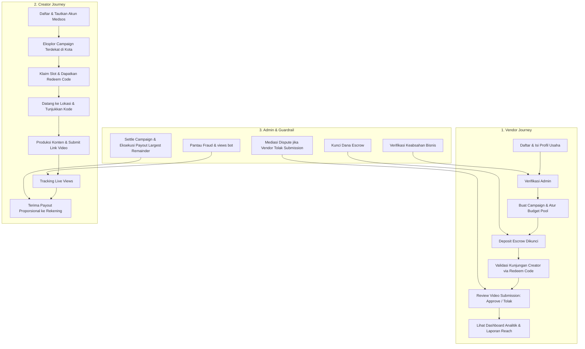

# DESIGN SPECIFICATION: KONTEM PLATFORM
> **Platform Location Campaign Berbasis CPM & Escrow untuk UMKM & Kreator Konten**  
> *Design System, UX Architecture, & Visual Specifications untuk AI/Claude Implementation*

---

## 1. Executive Summary & Visi Produk

**Kontem** adalah platform *third-party location campaign* yang menjembatani bisnis fisik (kuliner, kafe, destinasi wisata, hiburan) dengan kreator konten lokal (termasuk nano-creator tanpa batas minimum followers). 

Mengadopsi mekanika performa *views-based* (CPM / Cost Per Mille) seperti Motion Klip yang disesuaikan untuk promosi lokasi fisik:
1. **Pay for Real Impact (Bukan Vanity Metrics)**: Vendor tidak membayar harga mahal di muka untuk sekadar postingan endorsement yang belum tentu ditonton; budget dibagi proporsional berdasarkan *real views* yang didapat.
2. **Nano-Creator Empowerment**: Kreator dengan followers berapapun dapat ikut serta dan berpenghasilan selama konten mereka kreatif dan viral.
3. **Dual-Sided Trust (Anti-Ghosting & Anti-Scam)**: 
   - Sistem **Escrow**: Dana vendor dikunci di muka sebelum campaign tayang (kreator terjamin dibayar).
   - Sistem **Bukti Kunjungan (Redeem Code)**: Kreator wajib datang langsung ke outlet fisik untuk klaim komplimen & validasi kunjungan sebelum submit konten.
   - Sistem **Dispute & Audit Trail**: Penolakan submission wajib beralasan dan ditengahi oleh Admin.

---

## 2. Brand Identity & Visual Design Language

> **Referensi Desain**: Mengikuti gaya visual modern, ceria, bersih, dan berkelas seperti referensi *Volume One Studios / Modern Creator SaaS*:
> - Dominasi warna **Sky Blue / Cyan** yang segar dan membangkitkan rasa percaya (*high-trust*).
> - Aksen hangat **Warm Amber / Marigold** untuk elemen kuliner, bintang rating, dan *urgency*.
> - Sudut membulat lembut (*rounded pill / modern curved cards* `rounded-2xl` s/d `rounded-3xl`).
> - Komponen mengambang (*floating micro-cards & metric chips*) dengan bayangan difus yang elegan (*soft ambient shadows*).
> - Tipografi modern nan ramah dengan hierarki visual yang kuat (*Plus Jakarta Sans / Inter*).

### 2.1 Color Palette & Design Tokens

```css
/* Design Tokens (Tailwind v4 / CSS Variables) */
:root {
  /* Brand Primary - Vibrant Sky & Cyan (Utama) */
  --brand-50:  #f0f9ff;
  --brand-100: #e0f2fe;
  --brand-200: #bae6fd;
  --brand-400: #38bdf8; /* Accent Highlights */
  --brand-500: #0ea5e9; /* Primary Action Button & Main Theme */
  --brand-600: #0284c7; /* Hover & Active States */
  --brand-700: #0369a1;

  /* Secondary Accent - Warm Amber & Tangerine (Rating, Komplimen, Alert) */
  --accent-50:  #fffbeb;
  --accent-100: #fef3c7;
  --accent-400: #fbbf24;
  --accent-500: #f59e0b;
  --accent-600: #d97706;

  /* Neutrals & Surfaces */
  --bg-main:       #f8fafc; /* Slate-50: Latar belakang aplikasi yang sangat lembut */
  --surface-card:  #ffffff; /* Pure White Card */
  --surface-muted: #f1f5f9; /* Slate-100 */
  --text-heading:  #0f172a; /* Slate-900: Kontras tajam dan terbaca */
  --text-body:     #334155; /* Slate-700 */
  --text-muted:    #64748b; /* Slate-500 */
  --border-subtle: #e2e8f0; /* Slate-200 */
  --border-brand:  #bae6fd; /* Sky-200 */

  /* Status Tokens */
  --success-bg:    #ecfdf5; /* Emerald-50 */
  --success-text:  #059669; /* Emerald-600 */
  --warning-bg:    #fffbeb; /* Amber-50 */
  --warning-text:  #d97706; /* Amber-600 */
  --danger-bg:     #fef2f2; /* Rose-50 */
  --danger-text:   #e11d48; /* Rose-600 */
}
```

### 2.2 Typography Hierarchy

| Level | Desktop Size / Weight | Mobile Size / Weight | Karakter & Penggunaan |
| :--- | :--- | :--- | :--- |
| **Hero Display** | 48px – 56px / ExtraBold (800) | 36px / Bold (700) | `tracking-tight`, headline landing page dengan highlight warna brand |
| **H1 (Page Title)**| 32px – 36px / Bold (700) | 26px / Bold (700) | Header dashboard & judul modul |
| **H2 (Section)** | 24px – 28px / SemiBold (600) | 20px / SemiBold (600) | Judul seksi landing page & card besar |
| **H3 (Card Title)**| 18px – 20px / SemiBold (600) | 16px / SemiBold (600) | Judul kampanye, nama outlet, modal title |
| **Body Regular** | 15px – 16px / Regular (400) | 14px / Regular (400) | Teks deskripsi brief, penjelasan alur |
| **Micro / Badges**| 12px – 13px / Medium & SemiBold | 11px – 12px / Medium | Status pill, chip tag, CPM counter, tabular data |

### 2.3 UI Geometry, Elevation & Micro-Interactions

1. **Border Radius**:
   - Buttons, Inputs, Pill Badges: `rounded-full` (9999px)
   - Standard Cards & Feature Boxes: `rounded-2xl` (16px)
   - Hero Highlight Containers, Modals: `rounded-3xl` (24px)
2. **Shadow & Elevation (Soft Diffusion)**:
   - Floating Cards: `box-shadow: 0 20px 30px -10px rgba(14, 165, 233, 0.12), 0 8px 10px -6px rgba(0, 0, 0, 0.04);`
   - Normal Cards: `box-shadow: 0 1px 3px 0 rgba(0, 0, 0, 0.05), 0 1px 2px -1px rgba(0, 0, 0, 0.05);`
   - Hover Card Transition: `transform: translateY(-3px); box-shadow: 0 12px 24px -6px rgba(14, 165, 233, 0.15);`
3. **Decorative Elements (Sesuai Desain Acuan)**:
   - Floating badge dengan avatar tumpuk (*stacked avatars*) + bintang kepuasan (⭐️ 5.0).
   - Soft organic blobs di latar belakang hero (kuning pastel & biru langit transparan).
   - Mini metric widget mengambang: chip persentase naik (`+28% views bulan ini`), nominal payout, dan ikon hati/senyum.

---

## 3. Arsitektur Peran & Alur Pengguna (User Journeys)



### 3.1 Role 1: CREATOR (Nano & Local Content Creator)

#### Syarat & Profil Pendaftaran
- Akun terverifikasi (Email / Google Auth / Nomor WhatsApp).
- Tautkan minimal satu akun medsos aktif (TikTok / Instagram Reels / YouTube Shorts) untuk pembuktian kepemilikan.
- **Tanpa Batas Minimum Followers** (terbuka untuk kreator pemula dengan 200 hingga jutaan followers).
- Lokasi domisili (Kota/Kabupaten) untuk penyesuaian kampanye terdekat.
- Akun rekening bank / e-wallet untuk pencairan dana reward.

#### Fitur & UI Kebutuhan Creator
1. **Campaign Explorer**:
   - Filter lokasi/kota (radius terdekat), kategori (Kuliner, Cafe, Wisata Alam, Wahana/Rekreasi), besaran reward pool, rate CPM, dan slot tersisa.
   - Kartu campaign memuat foto tempat, menu/wahana unggulan, compliment (misal: "Gratis 2 Porsi Ramen + Minum"), dan deadline.
2. **Campaign Detail & Claim**:
   - Ringkasan brief: *Angle* wajib (suasana senja, menu favorit, higienitas), durasi video minimal (misal 30-60 detik), hal yang dilarang (membandingkan kompetitor).
   - Tombol klaim slot yang menghasilkan **Redeem Code / QR Unik**.
3. **Visit Validation (Bukti Kunjungan)**:
   - Layar kartu kode redeem digital untuk ditunjukkan kepada kasir/PIC vendor di outlet.
   - Status berganti dari `"Menunggu Kunjungan"` ➔ `"Kunjungan Terkonfirmasi"` setelah PIC vendor menekan konfirmasi di sistem.
4. **Submission Center**:
   - Form input URL konten publik (TikTok / Instagram Reel / YouTube Shorts).
   - Indikator status: `Menunggu Review`, `Disetujui`, `Perlu Revisi / Ditolak` (dengan tombol *Ajukan Banding ke Admin*).
5. **Earnings & Live Views Tracker**:
   - Kartu saldo mengambang: Estimasi perolehan rupiah berjalan sesuai porsi views terkumpul dibanding total views campaign.
   - Riwayat payout dan notifikasi otomatis (SMS/WA/Email/In-app).

---

### 3.2 Role 2: VENDOR (Resto, Kafe, Tempat Wisata)

#### Syarat & Profil Pendaftaran
- Nama usaha, alamat lengkap + pinpoint Google Maps, foto tempat, kategori bisnis, dan kontak WhatsApp PIC.
- Verifikasi awal oleh tim Admin (pengecekan Google Maps, review foto, dan telepon konfirmasi singkat).

#### Fitur & UI Kebutuhan Vendor
1. **Campaign Creation Wizard (Langkah demi Langkah)**:
   - **Step 1: Info Dasar & Kategori**: Template khusus Resto/F&B vs Tempat Wisata.
   - **Step 2: Komplimen / Fasilitas**: Voucher makan senilai Rp 150rb, gratis tiket masuk untuk 2 orang, dsb.
   - **Step 3: Budgeting & CPM**:
     - Input total pool dana promosi (misal: Rp 2.500.000).
     - Input rate CPM yang ditawarkan (misal: Rp 25.000 per 1.000 views).
     - Sistem otomatis menampilkan estimasi total target views (misal: 100.000 total views).
     - Batas kuota kreator (misal: maksimal 15 kreator).
   - **Step 4: Content Brief & Rules**: Panduan do's & don'ts, teks promosi yang wajib dicantumkan dalam caption/video.
   - **Step 5: Deposit Escrow**: Pembayaran di muka ke rekening penampung Kontem.
2. **In-Store Redeem Validator**:
   - Antarmuka super simpel bagi kasir/manajer resto di handphone: cukup masukkan 6 digit kode unik kreator atau scan QR untuk mengesahkan bahwa kreator benar-benar datang dan menikmati fasilitas.
3. **Submission Review Desk**:
   - Tampilan daftar video yang diunggah kreator dengan pratinjau instan.
   - Tombol **Setujui** atau **Tolak**. 
   - *Guardrail Anti-Abuse*: Jika menolak, vendor **wajib** memilih kategori pelanggaran brief (misal: "Nama resto tidak disebutkan", "Video menggunakan materi orang lain", "Kualitas gambar pecah/buram") dan melampirkan catatan detail.
4. **Live Performance Dashboard**:
   - Real-time views gauge, sisa hari campaign, persentase budget terserap, dan papan peringkat kreator terbaik (*Top Performing Creators*).
   - Tombol *"Undang Lagi"* untuk mengontrak kembali kreator yang performanya memuaskan.

---

### 3.3 Role 3: ADMIN & TRUST ARBITRATOR

#### Peran Utama
Sebagai penjaga keadilan dan integritas ekosistem dua sisi (*Two-Sided Trust Protocol*).

#### Fitur & UI Kebutuhan Admin
1. **Vendor Verification Queue**:
   - Antarmuka pengecekan data vendor baru (tinjau foto, tautan Google Maps, status PIC).
2. **Escrow & Settlement Desk**:
   - Verifikasi deposit dana masuk dari vendor.
   - *One-Click Settlement*: Mengunci angka views akhir saat periode kampanye berakhir, menghitung pembagian dana pool secara proporsional dengan metode *Largest Remainder*, memotong komisi platform (default 15%), dan mengeksekusi pencairan transfer ke kreator serta pengembalian sisa pool yang belum terserap ke vendor.
3. **Dispute & Mediation Center**:
   - Panel khusus jika ada kreator yang mengajukan banding terhadap penolakan submission oleh vendor.
   - Admin melihat video, mencocokkan dengan brief, melihat alasan vendor, dan menetapkan keputusan final yang mengikat.
4. **Anti-Fraud & Views Integrity Monitor**:
   - Sistem deteksi anomali: flag otomatis jika angka views turun (views medsos asli tidak pernah berkurang), lonjakan views bot yang mendadak, atau akun kreator ganda.
5. **Business Analytics & Export**:
   - Metrik GMV, *take-rate fee*, jumlah kreator aktif, total views tergenerasi untuk materi investor dan *pitching*.

---

## 4. Model Finansial, Escrow & Algoritma Payout

### 4.1 Mekanika Pembagian Pool Berbasis Views
Dua prinsip utama:
1. **Tarif Berbasis CPM**: Kreator mendapatkan `(Views / 1000) × CPM Rate`.
2. **Budget Pool Sebagai Plafon Keras (Hard Cap)**: Total biaya yang dibayar vendor tidak akan pernah melampaui dana pool yang sudah disetor di muka.

```
Kondisi A: Total Tagihan CPM < Budget Pool
- Setiap kreator dibayar penuh sesuai formula CPM.
- Sisa dana pool yang tidak terserap dikembalikan utuh (refund) ke vendor.
- Platform fee (15%) dipotong hanya dari pembayaran riil yang diterima kreator.

Kondisi B: Total Tagihan CPM >= Budget Pool (Over-Cap)
- Seluruh budget pool dibagi proporsional berdasarkan persentase kontribusi views:
  Bagian Kreator = (Views Kreator / Total Views Seluruh Kreator) × Budget Pool
- Menggunakan algoritma pembulatan "Largest Remainder" agar total payout genap 100% sampai ke satuan rupiah terkecil.
```

### 4.2 Simulasi Payout

| Kreator | Valid Views | Porsi Views | Payout Kotor (Pool Rp 2.500.000) | Fee Kontem (15%) | Payout Bersih Kreator |
| :--- | :--- | :--- | :--- | :--- | :--- |
| **@kuliner.malang** | 65.000 | 52,0% | Rp 1.300.000 | Rp 195.000 | **Rp 1.105.000** |
| **@foodiejatim** | 35.000 | 28,0% | Rp 700.000 | Rp 105.000 | **Rp 595.000** |
| **@nongkrong.yuk** | 25.000 | 20,0% | Rp 500.000 | Rp 75.000 | **Rp 425.000** |
| **TOTAL** | **125.000** | **100%** | **Rp 2.500.000** | **Rp 375.000** | **Rp 2.125.000** |

---

## 5. Blueprint Halaman & Spesifikasi Tata Letak (Layout Specs)

> Seluruh halaman dirancang dengan adaptasi langsung dari **Visual Referensi Desain** yang dikirimkan: menggunakan card putih membal, aksen pill button cyan cerah, floating micro-card statistik, avatar sosial, dan layout yang bernafas lapang.

### 5.1 LANDING PAGE (Sesuai Struktur Desain Referensi)

```
+-----------------------------------------------------------------------------------------------+
| [Logo: Kontem 📍]       Jelajah Campaign    Untuk Vendor    Cara Kerja    FAQ    [Masuk] [Daftar] |
+-----------------------------------------------------------------------------------------------+
|                                                                                               |
|  [Pill Badge: ✨ Platform Promosi Lokasi Fisik Berbasis Views #1]                             |
|                                                                                               |
|  Promosikan Tempat Anda Lewat          +---------------------------------------------------+  |
|  Kreator Lokal. Bayar Sesuai           | [Foto Kreator Muda Memegang HP di Kafe Estetik]   |  |
|  Views, Bukan Followers! ☕📍           |                                                   |  |
|                                         |  [Floating Badge Atas: ❤️ "Bantu UMKM Naik Kelas"] |  |
|  Hubungkan kafe, resto, dan tempat      |  [Floating Badge Kanan: 📈 "Rp 8.750.000 Payout"] |  |
|  wisata dengan ratusan kreator lokal.  |  [Floating Card Bawah: ⭐⭐⭐⭐⭐ "Konten viral!     |  |
|  Budget aman di escrow, views valid,    |   Omzet naik 3x lipat" - Resto Sambal Bu Dita]    |  |
|  pembagian adil proporsional.          +---------------------------------------------------+  |
|                                                                                               |
|  [Daftar sebagai Creator - Gratis]    [▶ Pelajari Cara Kerjanya]                              |
|                                                                                               |
|  [Avatars: 👤👤👤👤]  ⭐️⭐️⭐️⭐️⭐️ 2.500+ kreator lokal & resto telah bergabung                 |
+-----------------------------------------------------------------------------------------------+
|                                                                                               |
|  Didukung publikasi multi-platform konten video pendek:                                       |
|  [ TikTok ]          [ Instagram Reels ]          [ YouTube Shorts ]       [ Google Maps ]    |
|                                                                                               |
+-----------------------------------------------------------------------------------------------+
|                                                                                               |
|  [Pill Badge: 💡 Kenapa Kontem Lebih Unggul]                                                   |
|  Semua Yang Dibutuhkan Untuk Promosi Lokasi Fisik yang Viral & Transparan                      |
|                                                                                               |
|  +-------------------+  +-------------------+  +-------------------+                          |
|  | [🚀 Icon Biru]    |  | [👥 Icon Cyan]    |  | [💰 Icon Kuning]  |                          |
|  | Tanpa Batas       |  | Dana Aman         |  | Pembayaran Adil   |                          |
|  | Followers         |  | di Escrow         |  | Berbasis CPM      |                          |
|  | Nano-creator bebas|  | Vendor setor di   |  | Payout dihitung   |                          |
|  | berkarya, performa|  | depan, kreator    |  | murni dari views  |                          |
|  | konten nomor satu.|  | pasti dibayar.    |  | riil terverifikasi|                          |
|  +-------------------+  +-------------------+  +-------------------+                          |
|  +-------------------+  +-------------------+  +-------------------+                          |
|  | [📍 Icon Sky]     |  | [🛡️ Icon Indigo]  |  | [📈 Icon Emerald] |                          |
|  | Bukti Kunjungan   |  | Penengah Sengketa |  | Pantau Real-Time  |                          |
|  | Fisik (Redeem)    |  | Objektif          |  | & Transparan      |                          |
|  | Wajib datang ke   |  | Penolakan wajib   |  | Dashboard live    |                          |
|  | lokasi langsung.  |  | beralasan jelas.  |  | views & budget.   |                          |
|  +-------------------+  +-------------------+  +-------------------+                          |
|                                                                                               |
+-----------------------------------------------------------------------------------------------+
|                                                                                               |
|  +-----------------------------------------------------------------------------------------+  |
|  | [CONTAINER BIRU CYAN ELEGAN - Highlight Banner Cerita Sukses]                          |  |
|  |                                                                                         |  |
|  | +------------------+   Cerita Mitra Kontem                                              |  |
|  | | [Foto Owner Resto|   "Dulu bayar influencer jutaan tapi sepi pengunjung.              |  |
|  | |  tersenyum di    |    Di Kontem, 15 kreator datang bikin konten, views tembus         |  |
|  | |  depan kafenya]  |    300rb, dan kafe kami ramai setiap akhir pekan!"                 |  |
|  | +------------------+                                                                    |  |
|  |                        - Budi Pratama, Founder Kopi Senja Malang                        |  |
|  |                                                                                         |  |
|  |                        ✓ 100% Budget Terkonversi Menjadi Views                          |  |
|  |                        ✓ Komplimen Makanan Terbukti Dinikmati Kreator                   |  |
|  |                        ✓ Tidak Ada Risiko Pembayaran Bodong                             |  |
|  |                                                                                         |  |
|  |                        [Baca Studi Kasus Lengkap ➔]                                     |  |
|  +-----------------------------------------------------------------------------------------+  |
|                                                                                               |
+-----------------------------------------------------------------------------------------------+
|                                                                                               |
|  Mulai Campaign atau Hasilkan Cuan Hari Ini                                                    |
|                                                                                               |
|  +-----------------------------------------+     +-----------------------------------------+  |
|  | UNTUK KREATOR KONTEN                    |     | UNTUK PEMILIK RESTO & WISATA            |  |
|  | Makan Enak, Bikin Video, Dapat Cuan     |     | Promosi Ramai Tanpa Boncos              |  |
|  |                                         |     |                                         |  |
|  | ✓ Gratis pendaftaran 100%               |     | ✓ Tentukan sendiri budget pool mulai    |  |
|  | ✓ Akses puluhan campaign kuliner lokal  |     |   dari Rp 1.000.000                     |  |
|  | ✓ Komplimen menu & tiket masuk gratis   |     | ✓ Sistem Escrow aman bergaransi         |  |
|  | ✓ Pembayaran langsung ke rekening bank  |     | ✓ Akses ratusan kreator lokal siap liput|  |
|  |                                         |     |                                         |  |
|  | [Daftar Sebagai Creator ➔]              |     | [Buat Campaign Vendor ➔]                |  |
|  +-----------------------------------------+     +-----------------------------------------+  |
|                                                                                               |
+-----------------------------------------------------------------------------------------------+
| [Footer: Navigasi, Syarat Ketentuan, Kontak Support WhatsApp, & Copyright © Kontem]           |
+-----------------------------------------------------------------------------------------------+
```

---

### 5.2 CREATOR DASHBOARD (`/creator/*`)

#### 1. Halaman Browse Campaign (`/creator/campaigns`)
- **Top Bar Filter**: Pilihan Kota (Dropdown: Malang, Surabaya, Jakarta, Bandung, Bali), Kategori (Pill: Semua, Kuliner, Wisata Alam, Rekreasi), Urutkan (Budget Tertinggi, Slot Terbatas, Terbaru).
- **Campaign Card Component**:
  - Foto thumbnail tempat yang cerah & estetik.
  - Badge Kategori (Pill Kuning/Hijau) & Badge Kota (Pill Abu-abu).
  - Judul: "Kopi Senja Dinoyo - Menu Baru Toast & Mocktail".
  - Informasi Finansial: `Budget Pool: Rp 3.000.000` | `CPM: Rp 30.000/1k views`.
  - Fasilitas/Komplimen: "🍽️ Gratis 1 Makanan Utama + 1 Minuman".
  - Slot Indicator: Progress bar (misal: "Sisa 3 dari 12 slot").
  - Tombol Aksi: `Lihat Brief & Klaim Slot`.

#### 2. Halaman Detail Campaign & Klaim (`/creator/campaigns/[id]`)
- Banner lokasi + maps tersemat.
- Rincian Brief Kreatif:
  - *Must-Include Elements*: Menampilkan logo resto, suasana outdoor, review rasa makanan secara jujur, mention akun IG/TikTok @kopisenja.
  - *Do's & Don'ts*: Dilarang menjelekkan tempat lain, resolusi video minimal 1080p, durasi 30-90 detik.
- Kuota & Countdown Periode Campaign.
- Tombol: `Klaim Slot Sekarang` (Membuka popup persetujuan komitmen kunjungan).

#### 3. Halaman Tiket Kunjungan & Redeem (`/creator/active/[id]`)
- **Kartu Redeem Interaktif**:
  - Kode 6 Karakter Besar (contoh: `KT-7892`) + Tombol Salin.
  - QR Code yang dapat di-scan oleh kasir vendor.
  - Panduan: *"Tunjukkan layar ini ke kasir sebelum memesan menu komplimen Anda."*
  - Badge Status: `MENUNGGU VERIFIKASI KUNJUNGAN` (Oranye) ➔ `KUNJUNGAN TERVERIFIKASI` (Hijau).

#### 4. Form Submit Konten (`/creator/active/[id]/submit`)
- Input URL Video Publik (TikTok / Reels / Shorts).
- Checklist Konfirmasi:
  - [x] Konten dibuat sendiri di lokasi fisik.
  - [x] Sesuai dengan brief dan tidak diprivat.
- Preview otomatis thumbnail dan status moderasi vendor.

#### 5. Dashboard Pendapatan & Payout (`/creator/earnings`)
- Saldo Masuk, Saldo Berjalan (Estimasi), dan Riwayat Transfer Sukses.
- Tabel rincian views per campaign dengan formula transparan.

---

### 5.3 VENDOR DASHBOARD (`/vendor/*`)

#### 1. Beranda Vendor (`/vendor/dashboard`)
- Quick Stats: Total Views Dihasilkan, Total Creator yang Datang, Sisa Budget Escrow Aktif.
- Quick Action: Tombol `Input / Scan Kode Redeem Creator` (ditempatkan di tempat strategis untuk kasir).
- Daftar Campaign Aktif dengan status penyerapan budget.

#### 2. Wizard Buat Campaign Baru (`/vendor/campaigns/new`)
- Form interaktif dengan panduan harga rekomendasi (*CPM rate assistant* berdasarkan rata-rata kategori).
- Input Komplimen (misal: Diskon 100% hingga Rp 100.000).
- Penentuan kuota dan durasi hari kampanye.
- Ringkasan Tagihan Escrow + Instruksi Pembayaran (Virtual Account / QRIS).

#### 3. Panel Validator Redeem Kode Kasir (`/vendor/redeem`)
- Desain *mobile-friendly*: Input besar 6 digit kode.
- Saat kode dimasukkan, muncul info kreator: Foto profil, nama, dan hak komplimen yang didapat.
- Tombol hijau: `Konfirmasi Kehadiran & Berikan Komplimen`.

#### 4. Review Submission Creator (`/vendor/submissions`)
- Kolom kartu video masuk.
- Pemutar video terintegrasi atau tautan langsung ke platform medsos.
- Tombol:
  - `Setujui Konten`
  - `Minta Klarifikasi / Tolak` (Memunculkan formulir wajib: Alasan spesifik penolakan).

---

### 5.4 ADMIN CONTROL ROOM (`/admin/*`)

#### 1. Verifikasi Bisnis & Vendor Baru (`/admin/vendors`)
- Pengecekan bukti foto outlet, titik Google Maps, dan tombol approve/reject akun vendor.

#### 2. Dispute Resolution Hub (`/admin/disputes`)
- Daftar komplain dari kreator yang submission-nya ditolak vendor.
- Pratinjau video, teks brief, dan argumen kedua belah pihak.
- Tindakan admin: `Override Approve (Kreator Benar)` atau `Tetap Tolak (Vendor Benar)`.

#### 3. Views Tracking & Manual/API Input (`/admin/views`)
- Input batch views berkala sebelum sistem terintegrasi scraper/API resmi media sosial.
- Pengecekan kecurangan (anomali views bot).

#### 4. Escrow Settlement & Payout Manager (`/admin/payouts`)
- Tombol `Hitung Pembagian Pool` (menjalankan algoritma kalkulasi).
- Pratinjau daftar transfer sebelum dikirimkan ke payment gateway / bank transfer.

---

## 6. Spesifikasi Komponen UI (Design System Components)

### 6.1 Buttons & Interactive Controls

```tsx
// Variasi Tombol (Pill Style Sesuai Desain Acuan)
PrimaryButton:   "bg-sky-500 hover:bg-sky-600 text-white font-semibold rounded-full px-6 py-3 shadow-md shadow-sky-500/20 transition-all hover:scale-[1.02] active:scale-[0.98]"
SecondaryButton: "bg-white hover:bg-slate-50 text-slate-700 border border-slate-200 font-medium rounded-full px-6 py-3 shadow-sm transition-all"
GhostIconButton: "p-2 rounded-full hover:bg-sky-50 text-sky-600 transition-colors"
BadgePill:       "inline-flex items-center gap-1.5 px-3 py-1 rounded-full text-xs font-semibold tracking-wide"
```

### 6.2 Floating Badges & Card Decorators

```tsx
// Floating Metric Chip (Untuk Hero & Visual Banner)
<div className="absolute -top-4 -right-4 bg-white/95 backdrop-blur-md border border-sky-100 rounded-2xl p-3.5 shadow-xl shadow-sky-900/5 flex items-center gap-3">
  <div className="w-10 h-10 rounded-xl bg-sky-50 flex items-center justify-center text-sky-500 font-bold">
    📈
  </div>
  <div>
    <p className="text-xs text-slate-500 font-medium">Estimasi Views</p>
    <p className="text-sm font-bold text-slate-800 tabular-nums">48.500+ Tayang</p>
  </div>
</div>
```

### 6.3 State & Status Indicator Matrix

| State Name | Background | Text Color | Border Color | Icon |
| :--- | :--- | :--- | :--- | :--- |
| **Escrow Dikunci** | `bg-emerald-50` | `text-emerald-700` | `border-emerald-200` | 🔒 Gembok |
| **Menunggu Kunjungan**| `bg-amber-50` | `text-amber-700` | `border-amber-200` | 📍 Pin Lokasi |
| **Terkonfirmasi Hadir** | `bg-sky-50` | `text-sky-700` | `border-sky-200` | ☕ Cangkir/Check |
| **Dalam Review Vendor**| `bg-indigo-50`| `text-indigo-700` | `border-indigo-200` | ⏳ Jam Pasir |
| **Dispute / Sengketa** | `bg-rose-50` | `text-rose-700` | `border-rose-200` | ⚠️ Segitiga Waspada |
| **Payout Dicairkan** | `bg-teal-50` | `text-teal-700` | `border-teal-200` | 💸 Dompet Cuan |

---

## 7. Skema Data & Relasi Entitas (Prisma References)

```prisma
// Ringkasan Arsitektur Relasi Data Kontem
enum Role {
  CREATOR
  VENDOR
  ADMIN
}

enum CampaignStatus {
  DRAFT
  PENDING_ESCROW   // Menunggu setoran dana vendor
  ACTIVE           // Berjalan, bisa di-klaim kreator
  SETTLING         // Menghitung views final
  SETTLED          // Payout dibagikan, campaign selesai
}

enum RedeemStatus {
  CLAIMED          // Slot diklaim kreator
  USED             // Sudah datang ke outlet fisik (diverifikasi vendor)
  EXPIRED          // Tidak datang hingga batas waktu
}

enum SubmissionStatus {
  SUBMITTED
  APPROVED
  REJECTED
  DISPUTED
}

model User {
  id            String       @id @default(cuid())
  email         String       @unique
  role          Role
  fullName      String
  city          String?      // Domisili pencarian campaign
  tiktokHandle  String?
  igHandle      String?
  bankName      String?
  bankAccount   String?
  vendorProfile VendorProfile?
  submissions   Submission[]
  redeemCodes   RedeemCode[]
  payouts       Payout[]
}

model Campaign {
  id              String         @id @default(cuid())
  vendorId        String
  title           String
  category        String         // KULINER, CAFE, WISATA_ALAM, REKREASI
  budgetPool      Int            // Misal: 2500000 (Rp 2,5 juta)
  cpmRate         Int            // Misal: 25000 (Rp 25.000 / 1000 views)
  maxCreators     Int            // Kuota partisipan
  complimentText  String         // Fasilitas gratis yang didapat kreator
  briefGuidelines String         // Do's, don'ts, mandatory angle
  status          CampaignStatus
  startDate       DateTime
  endDate         DateTime
  redeemCodes     RedeemCode[]
  submissions     Submission[]
  payouts         Payout[]
}

model RedeemCode {
  id          String       @id @default(cuid())
  code        String       @unique // 6 digit unik (misal: "KT-8821")
  campaignId  String
  creatorId   String
  status      RedeemStatus @default(CLAIMED)
  verifiedAt  DateTime?    // Waktu kasir memvalidasi kehadiran
}

model Submission {
  id              String           @id @default(cuid())
  campaignId      String
  creatorId       String
  videoUrl        String
  status          SubmissionStatus @default(SUBMITTED)
  recordedViews   Int              @default(0)
  rejectionReason String?
  disputeNotes    String?
}

model Payout {
  id          String   @id @default(cuid())
  campaignId  String
  creatorId   String
  grossAmount Int      // Pembagian proporsional kotor
  feeAmount   Int      // Potongan fee platform (15%)
  netAmount   Int      // Uang yang masuk rekening kreator
  status      String   // PENDING / PAID
  paidAt      DateTime?
}
```

---

## 8. Panduan Nada Bahasa & Microcopy (Tone of Voice)

* **Bahasa Utama**: Bahasa Indonesia yang santun, energetik, suportif, dan profesional.
* **Untuk Kreator**:
  * *Friendly & Empowering*: "Jangan biarkan jumlah followers menghalangimu. Mulai liput resto lokal favoritmu dan raih penghasilan nyata!"
  * *Jelas & Transparan*: "Estimasi penghasilanmu saat ini Rp 450.000 dari 18.200 views yang terkumpul."
* **Untuk Vendor (Pemilik Usaha)**:
  * *Berorientasi Solusi & Efisiensi*: "Stop buang anggaran untuk endorsement tanpa kepastian hasil. Bayar hanya untuk views yang benar-benar tercipta."
  * *Rasa Aman*: "Dana pool Anda tersimpan aman di escrow dan hanya dicairkan untuk konten yang lolos verifikasi."

---

## 9. Petunjuk Prompting untuk Claude / AI Coding Assistant

Bila Anda menginstruksikan Claude untuk membuat atau memodifikasi halaman dalam proyek ini, gunakan format instruksi berikut:

```markdown
"Tolong buatkan komponen/halaman [Nama Halaman/Fitur] untuk Kontem. 
Gunakan panduan dari design.md:
- Visual Style: Mengacu pada design system cerah dengan primary sky-500, aksen amber-500, rounded pill buttons, rounded-2xl cards, dan soft ambient shadows.
- Role: [CREATOR / VENDOR / ADMIN]
- Logic & Guardrail: Pastikan validasi alur [misal: status redeem code sebelum submit / escrow check].
- Gunakan Next.js 16 App Router, Tailwind CSS v4, dan TypeScript."
```

---
*Dokumen ini adalah acuan desain resmi (Single Source of Truth) untuk pengembangan antarmuka dan implementasi sistem Kontem.*
