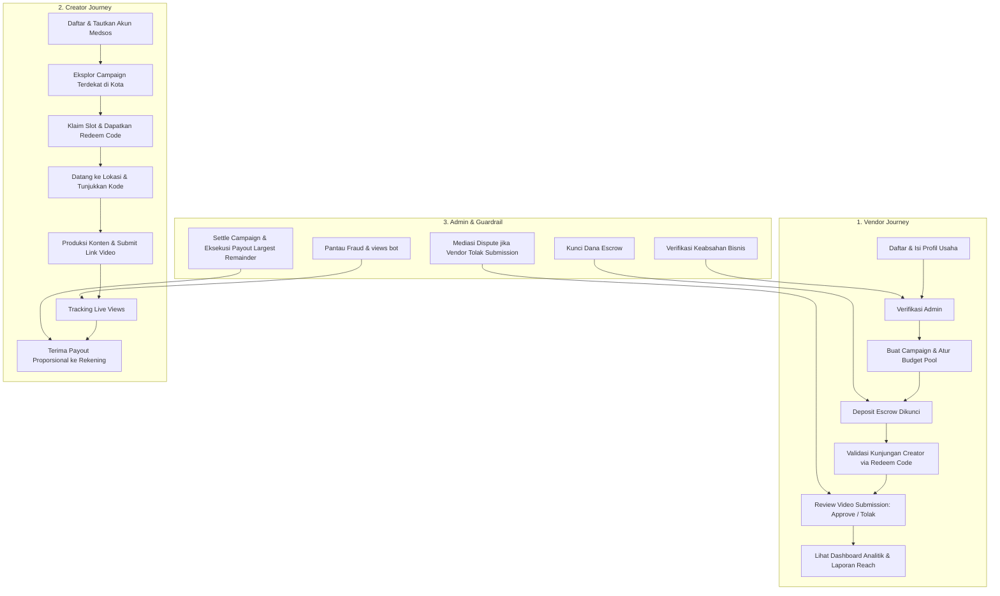

# DESIGN SPECIFICATION: KONTEM PLATFORM
> **Platform Location Campaign Berbasis CPM & Escrow untuk UMKM & Kreator Konten**  
> *Design System, UX Architecture, & Visual Specifications untuk AI/Claude Implementation*

---

## 1. Executive Summary & Visi Produk

**Kontem** adalah platform *third-party location campaign* yang menjembatani bisnis fisik (kuliner, kafe, destinasi wisata, hiburan) dengan kreator konten lokal (termasuk nano-creator tanpa batas minimum followers). 

Mengadopsi mekanika performa *views-based* (CPM / Cost Per Mille) seperti Motion Klip yang disesuaikan untuk promosi lokasi fisik:
1. **Pay for Real Impact (Bukan Vanity Metrics)**: Vendor tidak membayar harga mahal di muka untuk sekadar postingan endorsement yang belum tentu ditonton; budget dibagi proporsional berdasarkan *real views* yang didapat.
2. **Nano-Creator Empowerment**: Kreator dengan followers berapapun dapat ikut serta dan berpenghasilan selama konten mereka kreatif dan viral.
3. **Dual-Sided Trust (Anti-Ghosting & Anti-Scam)**: 
   - Sistem **Escrow**: Dana vendor dikunci di muka sebelum campaign tayang (kreator terjamin dibayar).
   - Sistem **Bukti Kunjungan (Redeem Code)**: Kreator wajib datang langsung ke outlet fisik untuk klaim komplimen & validasi kunjungan sebelum submit konten.
   - Sistem **Dispute & Audit Trail**: Penolakan submission wajib beralasan dan ditengahi oleh Admin.

---

## 2. Brand Identity & Visual Design Language

> **Referensi Desain**: Landing page *Volume One Studios — The Social Media Manager Insider*.
> Karakter yang diambil dari referensi tersebut:
>
> - **Biru azure yang cerah dan bersahabat**, bukan cyan teknis. Biru ini muncul di tombol utama, panel instruktur, dan pita seksi — dominan tapi tidak pernah gelap.
> - **Latar putih hangat** sebagai dasar, diselingi **pita biru sangat pucat** untuk memisahkan seksi tanpa garis tegas.
> - **Aksen marigold** dipakai hemat: konfeti dekoratif, bintang rating, dan satu sorotan angka. Tidak pernah untuk tombol utama.
> - **Teks judul biru navy pekat**, bukan hitam — menjaga kesan hangat sekaligus kontras tinggi.
> - **Sudut sangat membulat**: tombol berbentuk pill penuh, kartu 16–20px, panel besar 24–32px.
> - **Kartu putih mengambang** dengan bayangan difus berpendar biru tipis, dipakai untuk menonjolkan metrik dan testimoni.
> - **Konfeti vektor datar** (bentuk kelopak kecil biru muda & marigold) tersebar tipis di latar. Bentuk tegas, bukan blur.
> - **Tipografi geometris yang ramah** dengan judul tebal ber-*tracking* rapat dan teks isi berbobot ringan.

**Catatan kalibrasi**: nilai hex di bawah diturunkan secara visual dari tangkapan layar referensi, lalu dirapikan menjadi skala 50–800 yang konsisten. Nilai inilah yang berlaku — bukan padanan Tailwind bawaan.

### 2.1 Color Palette & Design Tokens

```css
/* Design Tokens Kontem (Tailwind v4 / CSS Variables) */
:root {
  /* ---------- Brand Primary — Azure ----------
     Tombol utama, panel sorotan, tautan, state aktif. */
  --brand-50:  #f1f8fe;
  --brand-100: #ddeefc;
  --brand-200: #bfe0fa;  /* garis tepi bernuansa brand */
  --brand-300: #95cdf6;
  --brand-400: #6eb8f3;  /* konfeti biru, aksen ringan */
  --brand-500: #4ba3ef;  /* PRIMARY — tombol & panel instruktur */
  --brand-600: #2e88dc;  /* hover / active */
  --brand-700: #236fb4;
  --brand-800: #1d5a92;

  /* ---------- Secondary Accent — Marigold ----------
     Konfeti, bintang rating, badge komplimen, sorotan angka.
     TIDAK untuk tombol aksi utama. */
  --accent-50:  #fff9ec;
  --accent-100: #fdefcd;
  --accent-300: #f9dc97;
  --accent-400: #f7c765;  /* konfeti marigold */
  --accent-500: #f4b13c;  /* bintang rating */
  --accent-600: #db9724;

  /* ---------- Ink — Navy kebiruan, bukan hitam ---------- */
  --ink-heading: #13304e;  /* judul & angka penting */
  --ink-body:    #53657a;  /* teks isi */
  --ink-muted:   #8496a8;  /* label, keterangan, placeholder */

  /* ---------- Surfaces ---------- */
  --bg-page:    #ffffff;   /* dasar halaman */
  --bg-warm:    #fdfcf9;   /* header & area hero, putih kehangatan */
  --bg-soft:    #e9f4fd;   /* pita seksi biru pucat */
  --surface:    #ffffff;   /* kartu */
  --surface-muted: #f3f7fa;/* baris tabel, kotak info dalam kartu */

  /* ---------- Borders ---------- */
  --border-subtle: #e3edf5; /* garis tepi umum, bernuansa biru */
  --border-brand:  #bfe0fa; /* garis tepi kartu aktif/terpilih */

  /* ---------- Status ----------
     Disetel ulang agar duduk berdampingan dengan azure:
     semuanya diturunkan saturasinya supaya tidak berteriak. */
  --success:      #0f9d76;  --success-bg: #e8f8f2;  --success-line: #b4e7d6;
  --warning:      #d9891b;  --warning-bg: #fff7e8;  --warning-line: #f8dfa8;
  --danger:       #e0555f;  --danger-bg:  #fdedee;  --danger-line:  #f7c9cd;
  --review:       #5566d6;  --review-bg:  #eef0fd;  --review-line:  #cdd4f7;
  --visit:        #236fb4;  --visit-bg:   #f1f8fe;  --visit-line:   #bfe0fa;
  --payout:       #0e8f8a;  --payout-bg:  #e9f7f6;  --payout-line:  #a9e4e1;
}
```

**Proporsi pemakaian warna** — inilah yang membuat tampilan terasa seperti referensi, bukan sekadar hex yang sama:

| Warna | Porsi layar | Dipakai untuk |
| :--- | :--- | :--- |
| Putih & putih hangat | ±70% | Dasar halaman dan kartu |
| Biru pucat `--bg-soft` | ±15% | Pita pemisah seksi, panel hero |
| Azure `--brand-500` | ±10% | Tombol utama, panel sorotan, ikon aktif |
| Navy `--ink-heading` | ±4% | Judul dan angka penting |
| Marigold | ±1% | Konfeti, bintang, satu sorotan per layar |

Marigold yang melebihi porsi itu membuat halaman terasa seperti promo diskon. Azure yang melebihi porsinya membuat halaman terasa seperti dasbor korporat.

### 2.2 Typography Hierarchy

Dua keluarga huruf, keduanya tersedia di Google Fonts:

- **Judul — `Plus Jakarta Sans`** (600/700/800). Geometris, hangat, dengan bentuk huruf membulat yang cocok dengan sudut kartu.
- **Teks & antarmuka — `Inter`** (400/500/600). Netral dan sangat terbaca pada ukuran kecil seperti label tabel dan angka tabular.

```css
--font-display: "Plus Jakarta Sans", ui-sans-serif, system-ui, sans-serif;
--font-sans:    "Inter", ui-sans-serif, system-ui, sans-serif;
```

| Level | Desktop | Mobile | Keluarga & Bobot | Tracking |
| :--- | :--- | :--- | :--- | :--- |
| **Hero Display** | 48–56px | 34–38px | Display / ExtraBold 800 | `-0.03em` |
| **H1 (Page Title)** | 30–34px | 25px | Display / Bold 700 | `-0.02em` |
| **H2 (Section)** | 24–28px | 21px | Display / Bold 700 | `-0.02em` |
| **H3 (Card Title)** | 17–19px | 16px | Display / SemiBold 600 | `-0.01em` |
| **Body Large** | 16–17px | 15px | Sans / Regular 400 | normal |
| **Body Regular** | 14–15px | 14px | Sans / Regular 400 | normal |
| **Label & Badge** | 12–13px | 11–12px | Sans / SemiBold 600 | `0.01em` |
| **Angka tabular** | mengikuti konteks | — | Sans / SemiBold 600 + `tabular-nums` | normal |

Aturan penting yang terbaca dari referensi:

1. **Judul selalu navy, tidak pernah biru azure.** Azure hanya untuk satu frasa yang sengaja disorot di dalam judul.
2. **Tinggi baris judul rapat** (`leading-[1.1]`), tinggi baris teks isi longgar (`leading-relaxed`).
3. **Jangan menumpuk bobot tebal.** Dalam satu kartu hanya ada satu elemen berbobot 700 ke atas.
4. **Label kecil tidak memakai huruf kapital semua.** Referensi memakai *sentence case* dengan bobot SemiBold.

### 2.3 UI Geometry, Elevation & Micro-Interactions

**Radius**

| Elemen | Radius |
| :--- | :--- |
| Tombol, badge, pill, chip, tab | `rounded-full` |
| Input, select, textarea | 12px (`rounded-xl`) |
| Kartu standar & kartu fitur | 16px (`rounded-2xl`) |
| Panel besar, banner, modal, kartu harga | 24px (`rounded-3xl`) |
| Kotak ikon di dalam kartu | 12px (`rounded-xl`) |

**Elevasi** — bayangan berpendar biru tipis, bukan abu-abu netral:

```css
--shadow-card:  0 1px 2px rgba(19, 48, 78, 0.04),
                0 2px 6px rgba(19, 48, 78, 0.04);
--shadow-float: 0 18px 32px -12px rgba(75, 163, 239, 0.22),
                0 6px 12px -6px rgba(19, 48, 78, 0.06);
--shadow-lift:  0 14px 26px -10px rgba(75, 163, 239, 0.26);
--shadow-brand: 0 6px 16px -6px rgba(75, 163, 239, 0.50);
```

- **Kartu biasa** memakai `--shadow-card` plus garis tepi `--border-subtle`. Bayangan sendirian tidak cukup memisahkan kartu dari latar putih.
- **Kartu mengambang** (metrik, testimoni, kartu harga) memakai `--shadow-float` tanpa garis tepi.
- **Tombol primary** memakai `--shadow-brand`.

**Micro-interaction**

- Kartu yang bisa diklik: `translateY(-2px)` + `--shadow-lift`, transisi 180ms.
- Tombol: `scale(1.02)` saat hover, `scale(0.98)` saat ditekan.
- Fokus keyboard: cincin 4px `--brand-100` dengan garis tepi `--brand-400`. Wajib terlihat jelas — jangan dimatikan.

**Elemen dekoratif**

Referensi memakai konfeti vektor datar: bentuk kelopak/oval kecil (8–20px) berwarna `--brand-400` dan `--accent-400`, tersebar jarang di sekitar hero dan judul seksi, dengan opasitas penuh dan tepi tajam.

- **Boleh**: bentuk SVG datar bertepi tajam, jumlahnya sedikit (4–8 per layar), tidak pernah menutupi teks.
- **Jangan**: lingkaran ber-*blur* besar (blob gradien). Efek itu membuat halaman terlihat seperti template generik, dan sudah dihapus dari implementasi — lihat bagian 10.

**Ikon**

Ikon adalah SVG bergaya garis (*stroke*) dengan ketebalan 2px dan sudut membulat, diletakkan di dalam kotak `rounded-xl` berlatar lembut sewarna maknanya (biru untuk netral/informasi, marigold untuk komplimen, hijau untuk status selesai). **Emoji tidak dipakai sebagai ikon antarmuka** — lihat bagian 10.

## 3. Arsitektur Peran & Alur Pengguna (User Journeys)



### 3.1 Role 1: CREATOR (Nano & Local Content Creator)

#### Syarat & Profil Pendaftaran
- Akun terverifikasi (Email / Google Auth / Nomor WhatsApp).
- Tautkan minimal satu akun medsos aktif (TikTok / Instagram Reels / YouTube Shorts) untuk pembuktian kepemilikan.
- **Tanpa Batas Minimum Followers** (terbuka untuk kreator pemula dengan 200 hingga jutaan followers).
- Lokasi domisili (Kota/Kabupaten) untuk penyesuaian kampanye terdekat.
- Akun rekening bank / e-wallet untuk pencairan dana reward.

#### Fitur & UI Kebutuhan Creator
1. **Campaign Explorer**:
   - Filter lokasi/kota (radius terdekat), kategori (Kuliner, Cafe, Wisata Alam, Wahana/Rekreasi), besaran reward pool, rate CPM, dan slot tersisa.
   - Kartu campaign memuat foto tempat, menu/wahana unggulan, compliment (misal: "Gratis 2 Porsi Ramen + Minum"), dan deadline.
2. **Campaign Detail & Claim**:
   - Ringkasan brief: *Angle* wajib (suasana senja, menu favorit, higienitas), durasi video minimal (misal 30-60 detik), hal yang dilarang (membandingkan kompetitor).
   - Tombol klaim slot yang menghasilkan **Redeem Code / QR Unik**.
3. **Visit Validation (Bukti Kunjungan)**:
   - Layar kartu kode redeem digital untuk ditunjukkan kepada kasir/PIC vendor di outlet.
   - Status berganti dari `"Menunggu Kunjungan"` ➔ `"Kunjungan Terkonfirmasi"` setelah PIC vendor menekan konfirmasi di sistem.
4. **Submission Center**:
   - Form input URL konten publik (TikTok / Instagram Reel / YouTube Shorts).
   - Indikator status: `Menunggu Review`, `Disetujui`, `Perlu Revisi / Ditolak` (dengan tombol *Ajukan Banding ke Admin*).
5. **Earnings & Live Views Tracker**:
   - Kartu saldo mengambang: Estimasi perolehan rupiah berjalan sesuai porsi views terkumpul dibanding total views campaign.
   - Riwayat payout dan notifikasi otomatis (SMS/WA/Email/In-app).

---

### 3.2 Role 2: VENDOR (Resto, Kafe, Tempat Wisata)

#### Syarat & Profil Pendaftaran
- Nama usaha, alamat lengkap + pinpoint Google Maps, foto tempat, kategori bisnis, dan kontak WhatsApp PIC.
- Verifikasi awal oleh tim Admin (pengecekan Google Maps, review foto, dan telepon konfirmasi singkat).

#### Fitur & UI Kebutuhan Vendor
1. **Campaign Creation Wizard (Langkah demi Langkah)**:
   - **Step 1: Info Dasar & Kategori**: Template khusus Resto/F&B vs Tempat Wisata.
   - **Step 2: Komplimen / Fasilitas**: Voucher makan senilai Rp 150rb, gratis tiket masuk untuk 2 orang, dsb.
   - **Step 3: Budgeting & CPM**:
     - Input total pool dana promosi (misal: Rp 2.500.000).
     - Input rate CPM yang ditawarkan (misal: Rp 25.000 per 1.000 views).
     - Sistem otomatis menampilkan estimasi total target views (misal: 100.000 total views).
     - Batas kuota kreator (misal: maksimal 15 kreator).
   - **Step 4: Content Brief & Rules**: Panduan do's & don'ts, teks promosi yang wajib dicantumkan dalam caption/video.
   - **Step 5: Deposit Escrow**: Pembayaran di muka ke rekening penampung Kontem.
2. **In-Store Redeem Validator**:
   - Antarmuka super simpel bagi kasir/manajer resto di handphone: cukup masukkan 6 digit kode unik kreator atau scan QR untuk mengesahkan bahwa kreator benar-benar datang dan menikmati fasilitas.
3. **Submission Review Desk**:
   - Tampilan daftar video yang diunggah kreator dengan pratinjau instan.
   - Tombol **Setujui** atau **Tolak**. 
   - *Guardrail Anti-Abuse*: Jika menolak, vendor **wajib** memilih kategori pelanggaran brief (misal: "Nama resto tidak disebutkan", "Video menggunakan materi orang lain", "Kualitas gambar pecah/buram") dan melampirkan catatan detail.
4. **Live Performance Dashboard**:
   - Real-time views gauge, sisa hari campaign, persentase budget terserap, dan papan peringkat kreator terbaik (*Top Performing Creators*).
   - Tombol *"Undang Lagi"* untuk mengontrak kembali kreator yang performanya memuaskan.

---

### 3.3 Role 3: ADMIN & TRUST ARBITRATOR

#### Peran Utama
Sebagai penjaga keadilan dan integritas ekosistem dua sisi (*Two-Sided Trust Protocol*).

#### Fitur & UI Kebutuhan Admin
1. **Vendor Verification Queue**:
   - Antarmuka pengecekan data vendor baru (tinjau foto, tautan Google Maps, status PIC).
2. **Escrow & Settlement Desk**:
   - Verifikasi deposit dana masuk dari vendor.
   - *One-Click Settlement*: Mengunci angka views akhir saat periode kampanye berakhir, menghitung pembagian dana pool secara proporsional dengan metode *Largest Remainder*, memotong komisi platform (default 15%), dan mengeksekusi pencairan transfer ke kreator serta pengembalian sisa pool yang belum terserap ke vendor.
3. **Dispute & Mediation Center**:
   - Panel khusus jika ada kreator yang mengajukan banding terhadap penolakan submission oleh vendor.
   - Admin melihat video, mencocokkan dengan brief, melihat alasan vendor, dan menetapkan keputusan final yang mengikat.
4. **Anti-Fraud & Views Integrity Monitor**:
   - Sistem deteksi anomali: flag otomatis jika angka views turun (views medsos asli tidak pernah berkurang), lonjakan views bot yang mendadak, atau akun kreator ganda.
5. **Business Analytics & Export**:
   - Metrik GMV, *take-rate fee*, jumlah kreator aktif, total views tergenerasi untuk materi investor dan *pitching*.

---

## 4. Model Finansial, Escrow & Algoritma Payout

### 4.1 Mekanika Pembagian Pool Berbasis Views
Dua prinsip utama:
1. **Tarif Berbasis CPM**: Kreator mendapatkan `(Views / 1000) × CPM Rate`.
2. **Budget Pool Sebagai Plafon Keras (Hard Cap)**: Total biaya yang dibayar vendor tidak akan pernah melampaui dana pool yang sudah disetor di muka.

```
Kondisi A: Total Tagihan CPM < Budget Pool
- Setiap kreator dibayar penuh sesuai formula CPM.
- Sisa dana pool yang tidak terserap dikembalikan utuh (refund) ke vendor.
- Platform fee (15%) dipotong hanya dari pembayaran riil yang diterima kreator.

Kondisi B: Total Tagihan CPM >= Budget Pool (Over-Cap)
- Seluruh budget pool dibagi proporsional berdasarkan persentase kontribusi views:
  Bagian Kreator = (Views Kreator / Total Views Seluruh Kreator) × Budget Pool
- Menggunakan algoritma pembulatan "Largest Remainder" agar total payout genap 100% sampai ke satuan rupiah terkecil.
```

### 4.2 Simulasi Payout

| Kreator | Valid Views | Porsi Views | Payout Kotor (Pool Rp 2.500.000) | Fee Kontem (15%) | Payout Bersih Kreator |
| :--- | :--- | :--- | :--- | :--- | :--- |
| **@kuliner.malang** | 65.000 | 52,0% | Rp 1.300.000 | Rp 195.000 | **Rp 1.105.000** |
| **@foodiejatim** | 35.000 | 28,0% | Rp 700.000 | Rp 105.000 | **Rp 595.000** |
| **@nongkrong.yuk** | 25.000 | 20,0% | Rp 500.000 | Rp 75.000 | **Rp 425.000** |
| **TOTAL** | **125.000** | **100%** | **Rp 2.500.000** | **Rp 375.000** | **Rp 2.125.000** |

---

## 5. Blueprint Halaman & Spesifikasi Tata Letak (Layout Specs)

> Seluruh halaman dirancang dengan adaptasi langsung dari **Visual Referensi Desain** yang dikirimkan: menggunakan card putih membal, aksen pill button cyan cerah, floating micro-card statistik, avatar sosial, dan layout yang bernafas lapang.

### 5.1 LANDING PAGE (Sesuai Struktur Desain Referensi)

> Emoji pada sketsa di bawah hanya penanda posisi ikon dalam diagram ASCII —
> pada implementasi semuanya menjadi ikon SVG garis. Lihat bagian 2.3 dan 10.

```
+-----------------------------------------------------------------------------------------------+
| [Logo: Kontem 📍]       Jelajah Campaign    Untuk Vendor    Cara Kerja    FAQ    [Masuk] [Daftar] |
+-----------------------------------------------------------------------------------------------+
|                                                                                               |
|  [Pill Badge: ✨ Platform Promosi Lokasi Fisik Berbasis Views #1]                             |
|                                                                                               |
|  Promosikan Tempat Anda Lewat          +---------------------------------------------------+  |
|  Kreator Lokal. Bayar Sesuai           | [Foto Kreator Muda Memegang HP di Kafe Estetik]   |  |
|  Views, Bukan Followers! ☕📍           |                                                   |  |
|                                         |  [Floating Badge Atas: ❤️ "Bantu UMKM Naik Kelas"] |  |
|  Hubungkan kafe, resto, dan tempat      |  [Floating Badge Kanan: 📈 "Rp 8.750.000 Payout"] |  |
|  wisata dengan ratusan kreator lokal.  |  [Floating Card Bawah: ⭐⭐⭐⭐⭐ "Konten viral!     |  |
|  Budget aman di escrow, views valid,    |   Omzet naik 3x lipat" - Resto Sambal Bu Dita]    |  |
|  pembagian adil proporsional.          +---------------------------------------------------+  |
|                                                                                               |
|  [Daftar sebagai Creator - Gratis]    [▶ Pelajari Cara Kerjanya]                              |
|                                                                                               |
|  [Avatars: 👤👤👤👤]  ⭐️⭐️⭐️⭐️⭐️ 2.500+ kreator lokal & resto telah bergabung                 |
+-----------------------------------------------------------------------------------------------+
|                                                                                               |
|  Didukung publikasi multi-platform konten video pendek:                                       |
|  [ TikTok ]          [ Instagram Reels ]          [ YouTube Shorts ]       [ Google Maps ]    |
|                                                                                               |
+-----------------------------------------------------------------------------------------------+
|                                                                                               |
|  [Pill Badge: 💡 Kenapa Kontem Lebih Unggul]                                                   |
|  Semua Yang Dibutuhkan Untuk Promosi Lokasi Fisik yang Viral & Transparan                      |
|                                                                                               |
|  +-------------------+  +-------------------+  +-------------------+                          |
|  | [🚀 Icon Biru]    |  | [👥 Icon Cyan]    |  | [💰 Icon Kuning]  |                          |
|  | Tanpa Batas       |  | Dana Aman         |  | Pembayaran Adil   |                          |
|  | Followers         |  | di Escrow         |  | Berbasis CPM      |                          |
|  | Nano-creator bebas|  | Vendor setor di   |  | Payout dihitung   |                          |
|  | berkarya, performa|  | depan, kreator    |  | murni dari views  |                          |
|  | konten nomor satu.|  | pasti dibayar.    |  | riil terverifikasi|                          |
|  +-------------------+  +-------------------+  +-------------------+                          |
|  +-------------------+  +-------------------+  +-------------------+                          |
|  | [📍 Icon Sky]     |  | [🛡️ Icon Indigo]  |  | [📈 Icon Emerald] |                          |
|  | Bukti Kunjungan   |  | Penengah Sengketa |  | Pantau Real-Time  |                          |
|  | Fisik (Redeem)    |  | Objektif          |  | & Transparan      |                          |
|  | Wajib datang ke   |  | Penolakan wajib   |  | Dashboard live    |                          |
|  | lokasi langsung.  |  | beralasan jelas.  |  | views & budget.   |                          |
|  +-------------------+  +-------------------+  +-------------------+                          |
|                                                                                               |
+-----------------------------------------------------------------------------------------------+
|                                                                                               |
|  +-----------------------------------------------------------------------------------------+  |
|  | [CONTAINER BIRU CYAN ELEGAN - Highlight Banner Cerita Sukses]                          |  |
|  |                                                                                         |  |
|  | +------------------+   Cerita Mitra Kontem                                              |  |
|  | | [Foto Owner Resto|   "Dulu bayar influencer jutaan tapi sepi pengunjung.              |  |
|  | |  tersenyum di    |    Di Kontem, 15 kreator datang bikin konten, views tembus         |  |
|  | |  depan kafenya]  |    300rb, dan kafe kami ramai setiap akhir pekan!"                 |  |
|  | +------------------+                                                                    |  |
|  |                        - Budi Pratama, Founder Kopi Senja Malang                        |  |
|  |                                                                                         |  |
|  |                        ✓ 100% Budget Terkonversi Menjadi Views                          |  |
|  |                        ✓ Komplimen Makanan Terbukti Dinikmati Kreator                   |  |
|  |                        ✓ Tidak Ada Risiko Pembayaran Bodong                             |  |
|  |                                                                                         |  |
|  |                        [Baca Studi Kasus Lengkap ➔]                                     |  |
|  +-----------------------------------------------------------------------------------------+  |
|                                                                                               |
+-----------------------------------------------------------------------------------------------+
|                                                                                               |
|  Mulai Campaign atau Hasilkan Cuan Hari Ini                                                    |
|                                                                                               |
|  +-----------------------------------------+     +-----------------------------------------+  |
|  | UNTUK KREATOR KONTEN                    |     | UNTUK PEMILIK RESTO & WISATA            |  |
|  | Makan Enak, Bikin Video, Dapat Cuan     |     | Promosi Ramai Tanpa Boncos              |  |
|  |                                         |     |                                         |  |
|  | ✓ Gratis pendaftaran 100%               |     | ✓ Tentukan sendiri budget pool mulai    |  |
|  | ✓ Akses puluhan campaign kuliner lokal  |     |   dari Rp 1.000.000                     |  |
|  | ✓ Komplimen menu & tiket masuk gratis   |     | ✓ Sistem Escrow aman bergaransi         |  |
|  | ✓ Pembayaran langsung ke rekening bank  |     | ✓ Akses ratusan kreator lokal siap liput|  |
|  |                                         |     |                                         |  |
|  | [Daftar Sebagai Creator ➔]              |     | [Buat Campaign Vendor ➔]                |  |
|  +-----------------------------------------+     +-----------------------------------------+  |
|                                                                                               |
+-----------------------------------------------------------------------------------------------+
| [Footer: Navigasi, Syarat Ketentuan, Kontak Support WhatsApp, & Copyright © Kontem]           |
+-----------------------------------------------------------------------------------------------+
```

---

### 5.2 CREATOR DASHBOARD (`/creator/*`)

#### 1. Halaman Browse Campaign (`/creator/campaigns`)
- **Top Bar Filter**: Pilihan Kota (Dropdown: Malang, Surabaya, Jakarta, Bandung, Bali), Kategori (Pill: Semua, Kuliner, Wisata Alam, Rekreasi), Urutkan (Budget Tertinggi, Slot Terbatas, Terbaru).
- **Campaign Card Component**:
  - Foto thumbnail tempat yang cerah & estetik.
  - Badge Kategori (Pill Kuning/Hijau) & Badge Kota (Pill Abu-abu).
  - Judul: "Kopi Senja Dinoyo - Menu Baru Toast & Mocktail".
  - Informasi Finansial: `Budget Pool: Rp 3.000.000` | `CPM: Rp 30.000/1k views`.
  - Fasilitas/Komplimen: "🍽️ Gratis 1 Makanan Utama + 1 Minuman".
  - Slot Indicator: Progress bar (misal: "Sisa 3 dari 12 slot").
  - Tombol Aksi: `Lihat Brief & Klaim Slot`.

#### 2. Halaman Detail Campaign & Klaim (`/creator/campaigns/[id]`)
- Banner lokasi + maps tersemat.
- Rincian Brief Kreatif:
  - *Must-Include Elements*: Menampilkan logo resto, suasana outdoor, review rasa makanan secara jujur, mention akun IG/TikTok @kopisenja.
  - *Do's & Don'ts*: Dilarang menjelekkan tempat lain, resolusi video minimal 1080p, durasi 30-90 detik.
- Kuota & Countdown Periode Campaign.
- Tombol: `Klaim Slot Sekarang` (Membuka popup persetujuan komitmen kunjungan).

#### 3. Halaman Tiket Kunjungan & Redeem (`/creator/active/[id]`)
- **Kartu Redeem Interaktif**:
  - Kode 6 Karakter Besar (contoh: `KT-7892`) + Tombol Salin.
  - QR Code yang dapat di-scan oleh kasir vendor.
  - Panduan: *"Tunjukkan layar ini ke kasir sebelum memesan menu komplimen Anda."*
  - Badge Status: `MENUNGGU VERIFIKASI KUNJUNGAN` (Oranye) ➔ `KUNJUNGAN TERVERIFIKASI` (Hijau).

#### 4. Form Submit Konten (`/creator/active/[id]/submit`)
- Input URL Video Publik (TikTok / Reels / Shorts).
- Checklist Konfirmasi:
  - [x] Konten dibuat sendiri di lokasi fisik.
  - [x] Sesuai dengan brief dan tidak diprivat.
- Preview otomatis thumbnail dan status moderasi vendor.

#### 5. Dashboard Pendapatan & Payout (`/creator/earnings`)
- Saldo Masuk, Saldo Berjalan (Estimasi), dan Riwayat Transfer Sukses.
- Tabel rincian views per campaign dengan formula transparan.

---

### 5.3 VENDOR DASHBOARD (`/vendor/*`)

#### 1. Beranda Vendor (`/vendor/dashboard`)
- Quick Stats: Total Views Dihasilkan, Total Creator yang Datang, Sisa Budget Escrow Aktif.
- Quick Action: Tombol `Input / Scan Kode Redeem Creator` (ditempatkan di tempat strategis untuk kasir).
- Daftar Campaign Aktif dengan status penyerapan budget.

#### 2. Wizard Buat Campaign Baru (`/vendor/campaigns/new`)
- Form interaktif dengan panduan harga rekomendasi (*CPM rate assistant* berdasarkan rata-rata kategori).
- Input Komplimen (misal: Diskon 100% hingga Rp 100.000).
- Penentuan kuota dan durasi hari kampanye.
- Ringkasan Tagihan Escrow + Instruksi Pembayaran (Virtual Account / QRIS).

#### 3. Panel Validator Redeem Kode Kasir (`/vendor/redeem`)
- Desain *mobile-friendly*: Input besar 6 digit kode.
- Saat kode dimasukkan, muncul info kreator: Foto profil, nama, dan hak komplimen yang didapat.
- Tombol hijau: `Konfirmasi Kehadiran & Berikan Komplimen`.

#### 4. Review Submission Creator (`/vendor/submissions`)
- Kolom kartu video masuk.
- Pemutar video terintegrasi atau tautan langsung ke platform medsos.
- Tombol:
  - `Setujui Konten`
  - `Minta Klarifikasi / Tolak` (Memunculkan formulir wajib: Alasan spesifik penolakan).

---

### 5.4 ADMIN CONTROL ROOM (`/admin/*`)

#### 1. Verifikasi Bisnis & Vendor Baru (`/admin/vendors`)
- Pengecekan bukti foto outlet, titik Google Maps, dan tombol approve/reject akun vendor.

#### 2. Dispute Resolution Hub (`/admin/disputes`)
- Daftar komplain dari kreator yang submission-nya ditolak vendor.
- Pratinjau video, teks brief, dan argumen kedua belah pihak.
- Tindakan admin: `Override Approve (Kreator Benar)` atau `Tetap Tolak (Vendor Benar)`.

#### 3. Views Tracking & Manual/API Input (`/admin/views`)
- Input batch views berkala sebelum sistem terintegrasi scraper/API resmi media sosial.
- Pengecekan kecurangan (anomali views bot).

#### 4. Escrow Settlement & Payout Manager (`/admin/payouts`)
- Tombol `Hitung Pembagian Pool` (menjalankan algoritma kalkulasi).
- Pratinjau daftar transfer sebelum dikirimkan ke payment gateway / bank transfer.

---

## 6. Spesifikasi Komponen UI (Design System Components)

### 6.1 Buttons & Interactive Controls

```tsx
// Semua tombol berbentuk pill penuh, padding lega, transisi 180ms.
PrimaryButton:
  "rounded-full bg-[--brand-500] px-6 py-3 text-sm font-semibold text-white
   shadow-[--shadow-brand] transition-all
   hover:bg-[--brand-600] hover:scale-[1.02] active:scale-[0.98]"

SecondaryButton:
  "rounded-full border border-[--border-subtle] bg-white px-6 py-3 text-sm
   font-semibold text-[--ink-body] shadow-[--shadow-card] transition-all
   hover:border-[--border-brand] hover:bg-[--bg-warm]"

AccentButton:   // hanya untuk sorotan sekunder, bukan aksi utama
  "rounded-full bg-[--accent-500] px-6 py-3 text-sm font-semibold text-white
   hover:bg-[--accent-600]"

GhostButton:
  "rounded-full px-4 py-2 text-sm font-medium text-[--ink-muted]
   transition-colors hover:bg-[--brand-50] hover:text-[--brand-700]"

// Kontrol isian memakai radius 12px, bukan pill — teks panjang harus terbaca.
Input:
  "w-full rounded-xl border border-[--border-subtle] bg-white px-4 py-2.5
   text-sm text-[--ink-body] outline-none transition-colors
   placeholder:text-[--ink-muted]
   focus:border-[--brand-400] focus:ring-4 focus:ring-[--brand-100]"
```

Aturan hierarki: **satu tombol primary per layar**. Aksi lain memakai
secondary atau ghost. Dua tombol azure bersebelahan membuat pengguna ragu mana
langkah yang dimaksud.

### 6.2 Floating Cards & Metric Chips

Kartu putih mengambang dipakai untuk menonjolkan satu angka atau satu kutipan —
persis seperti kartu "Monthly Income" dan kartu testimoni pada referensi.

```tsx
<div className="rounded-2xl bg-white p-4 shadow-[--shadow-float]">
  <p className="text-xs text-[--ink-muted]">Estimasi penghasilan</p>
  <p className="mt-1 font-display text-lg font-bold tabular-nums
                text-[--ink-heading]">
    Rp 1.105.000
  </p>
  <p className="mt-0.5 text-xs font-semibold text-[--success]">
    +28% pekan ini
  </p>
</div>
```

Ketentuan:

- Isinya maksimal tiga baris: label, angka, satu keterangan pendek.
- Tanpa garis tepi — bayangan mengambang yang memisahkannya dari latar.
- Maksimal tiga kartu mengambang per layar. Lebih dari itu tidak ada lagi yang terasa menonjol.
- **Angka di dalamnya wajib berasal dari database.** Kartu metrik berisi angka karangan adalah alasan utama sebuah halaman terbaca sebagai template.

### 6.3 State & Status Indicator Matrix

Semua badge berbentuk pill dengan garis tepi tipis, latar lembut, dan ikon garis
berukuran 14px di sebelah kiri.

| State | Token latar | Token teks | Token garis | Ikon |
| :--- | :--- | :--- | :--- | :--- |
| **Escrow dikunci / disetujui** | `--success-bg` | `--success` | `--success-line` | Check |
| **Menunggu kunjungan** | `--warning-bg` | `--warning` | `--warning-line` | MapPin |
| **Kunjungan terkonfirmasi** | `--visit-bg` | `--visit` | `--visit-line` | Coffee |
| **Dalam review vendor** | `--review-bg` | `--review` | `--review-line` | Clock |
| **Ditolak / sengketa** | `--danger-bg` | `--danger` | `--danger-line` | AlertTriangle |
| **Payout dicairkan** | `--payout-bg` | `--payout` | `--payout-line` | Wallet |
| **Komplimen / sorotan** | `--accent-50` | `--accent-600` | `--accent-100` | Star |
| **Netral / draft** | `--surface-muted` | `--ink-muted` | `--border-subtle` | — |

```tsx
BadgePill:
  "inline-flex items-center gap-1.5 rounded-full border px-2.5 py-1
   text-xs font-semibold"
```

### 6.4 Kartu Fitur & Kotak Ikon

Kartu fitur pada referensi berisi kotak ikon kecil di atas, judul pendek, lalu
dua baris penjelasan — bukan paragraf panjang.

```tsx
<div className="rounded-2xl border border-[--border-subtle] bg-white p-5
                shadow-[--shadow-card]">
  <div className="flex h-10 w-10 items-center justify-center rounded-xl
                  bg-[--brand-50] text-[--brand-700]">
    <IconShield className="h-5 w-5" strokeWidth={2} />
  </div>
  <h3 className="mt-4 font-display font-semibold text-[--ink-heading]">
    Dana dikunci di escrow
  </h3>
  <p className="mt-1.5 text-sm leading-relaxed text-[--ink-muted]">
    Vendor menyetor di depan. Creator tidak pernah bekerja tanpa jaminan.
  </p>
</div>
```

Warna kotak ikon mengikuti maknanya, bukan dirotasi asal supaya "berwarna-warni":
biru untuk mekanisme netral, marigold untuk komplimen dan imbalan, hijau untuk
hasil yang sudah beres.

## 7. Skema Data & Relasi Entitas (Prisma References)

```prisma
// Ringkasan Arsitektur Relasi Data Kontem
enum Role {
  CREATOR
  VENDOR
  ADMIN
}

enum CampaignStatus {
  DRAFT
  PENDING_ESCROW   // Menunggu setoran dana vendor
  ACTIVE           // Berjalan, bisa di-klaim kreator
  SETTLING         // Menghitung views final
  SETTLED          // Payout dibagikan, campaign selesai
}

enum RedeemStatus {
  CLAIMED          // Slot diklaim kreator
  USED             // Sudah datang ke outlet fisik (diverifikasi vendor)
  EXPIRED          // Tidak datang hingga batas waktu
}

enum SubmissionStatus {
  SUBMITTED
  APPROVED
  REJECTED
  DISPUTED
}

model User {
  id            String       @id @default(cuid())
  email         String       @unique
  role          Role
  fullName      String
  city          String?      // Domisili pencarian campaign
  tiktokHandle  String?
  igHandle      String?
  bankName      String?
  bankAccount   String?
  vendorProfile VendorProfile?
  submissions   Submission[]
  redeemCodes   RedeemCode[]
  payouts       Payout[]
}

model Campaign {
  id              String         @id @default(cuid())
  vendorId        String
  title           String
  category        String         // KULINER, CAFE, WISATA_ALAM, REKREASI
  budgetPool      Int            // Misal: 2500000 (Rp 2,5 juta)
  cpmRate         Int            // Misal: 25000 (Rp 25.000 / 1000 views)
  maxCreators     Int            // Kuota partisipan
  complimentText  String         // Fasilitas gratis yang didapat kreator
  briefGuidelines String         // Do's, don'ts, mandatory angle
  status          CampaignStatus
  startDate       DateTime
  endDate         DateTime
  redeemCodes     RedeemCode[]
  submissions     Submission[]
  payouts         Payout[]
}

model RedeemCode {
  id          String       @id @default(cuid())
  code        String       @unique // 6 digit unik (misal: "KT-8821")
  campaignId  String
  creatorId   String
  status      RedeemStatus @default(CLAIMED)
  verifiedAt  DateTime?    // Waktu kasir memvalidasi kehadiran
}

model Submission {
  id              String           @id @default(cuid())
  campaignId      String
  creatorId       String
  videoUrl        String
  status          SubmissionStatus @default(SUBMITTED)
  recordedViews   Int              @default(0)
  rejectionReason String?
  disputeNotes    String?
}

model Payout {
  id          String   @id @default(cuid())
  campaignId  String
  creatorId   String
  grossAmount Int      // Pembagian proporsional kotor
  feeAmount   Int      // Potongan fee platform (15%)
  netAmount   Int      // Uang yang masuk rekening kreator
  status      String   // PENDING / PAID
  paidAt      DateTime?
}
```

---

## 8. Panduan Nada Bahasa & Microcopy (Tone of Voice)

* **Bahasa Utama**: Bahasa Indonesia yang santun, energetik, suportif, dan profesional.
* **Untuk Kreator**:
  * *Friendly & Empowering*: "Jangan biarkan jumlah followers menghalangimu. Mulai liput resto lokal favoritmu dan raih penghasilan nyata!"
  * *Jelas & Transparan*: "Estimasi penghasilanmu saat ini Rp 450.000 dari 18.200 views yang terkumpul."
* **Untuk Vendor (Pemilik Usaha)**:
  * *Berorientasi Solusi & Efisiensi*: "Stop buang anggaran untuk endorsement tanpa kepastian hasil. Bayar hanya untuk views yang benar-benar tercipta."
  * *Rasa Aman*: "Dana pool Anda tersimpan aman di escrow dan hanya dicairkan untuk konten yang lolos verifikasi."

---

## 9. Petunjuk Prompting untuk Claude / AI Coding Assistant

Bila Anda menginstruksikan Claude untuk membuat atau memodifikasi halaman dalam proyek ini, gunakan format instruksi berikut:

```markdown
"Tolong buatkan komponen/halaman [Nama Halaman/Fitur] untuk Kontem. 
Gunakan panduan dari design.md:
- Visual Style: Ikuti token pada bagian 2.1 — primary azure `--brand-500` (#4ba3ef), aksen marigold `--accent-500` dipakai hemat, judul navy `--ink-heading`, tombol pill, kartu `rounded-2xl`, bayangan difus berpendar biru. Jangan memakai padanan Tailwind bawaan seperti `sky-500` atau `amber-500`.
- Role: [CREATOR / VENDOR / ADMIN]
- Logic & Guardrail: Pastikan validasi alur [misal: status redeem code sebelum submit / escrow check].
- Gunakan Next.js 16 App Router, Tailwind CSS v4, dan TypeScript."
```

---
## 10. Catatan Implementasi & Status Sinkronisasi

### 10.1 Keputusan yang sudah diserap ke dalam spesifikasi

Setelah tinjauan tampilan pertama, enam ketentuan versi awal dokumen ini diubah
karena hasilnya terbaca sebagai desain hasil generate mesin, bukan desain yang
dirancang. Perubahannya **sudah dijadikan aturan resmi** di bagian 2 dan 6:

| Versi awal | Berlaku sekarang | Alasan |
| :--- | :--- | :--- |
| Ikon emoji (🚀 👥 💰 📍 🛡️ 📈) | Ikon SVG garis 2px | Emoji berbeda bentuk di tiap OS dan tidak bisa mengikuti token warna |
| Soft organic blob ber-*blur* | Konfeti vektor datar bertepi tajam | Blob gradien adalah penanda template generik |
| Container gradien | Permukaan datar + garis tepi | Gradien bertumpuk menurunkan keterbacaan |
| Stacked avatar + rating ⭐️ 5.0 | Dihapus | Data karangan |
| "2.500+ kreator telah bergabung" | Hitungan nyata dari database | Angka publik tidak boleh dikarang |
| ExtraBold menyeluruh | Bold untuk judul, SemiBold untuk sisanya | Penekanan menyeluruh meniadakan penekanan |

Aturan operasionalnya ada di `CONVENTIONS.md` bagian "Ikon" dan "Menahan diri
dalam dekorasi".

### 10.2 Selisih spesifikasi terhadap kode saat ini

Palet dan tipografi pada bagian 2 **baru dikalibrasi ulang ke referensi Volume
One Studios dan belum diterapkan ke kode.** Yang masih berbeda:

| Aspek | Kode saat ini | Spesifikasi baru |
| :--- | :--- | :--- |
| Primary | `#0ea5e9` (sky, cenderung cyan) | `#4ba3ef` (azure, lebih lembut) |
| Aksen | `#f59e0b` | `#f4b13c` |
| Warna judul | `#0f172a` (slate, netral) | `#13304e` (navy kebiruan) |
| Warna teks isi | `#334155` | `#53657a` |
| Latar halaman | `#f8fafc` rata | `#ffffff` + pita `#e9f4fd` + hero `#fdfcf9` |
| Garis tepi | `#e2e8f0` (abu netral) | `#e3edf5` (bernuansa biru) |
| Huruf | Plus Jakarta Sans untuk semua | Plus Jakarta Sans (judul) + Inter (isi) |
| Status | Nada penuh | Saturasi diturunkan agar duduk dengan azure |
| Bayangan | Berpendar `rgba(14,165,233,…)` | Berpendar `rgba(75,163,239,…)`, lebih halus |
| Dekorasi | Tidak ada | Konfeti vektor datar, 4–8 per layar |

Titik sentuh penerapan terpusat di dua berkas: `src/app/globals.css` untuk
seluruh token, dan `src/components/ui/` untuk komponennya. Halaman tidak perlu
disentuh karena semuanya memakai token dan barrel design system.

---

*Dokumen ini adalah acuan desain resmi (Single Source of Truth) untuk pengembangan antarmuka dan implementasi sistem Kontem.*
